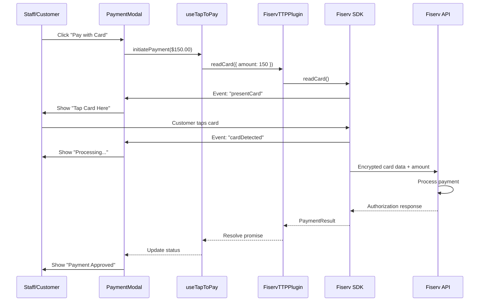
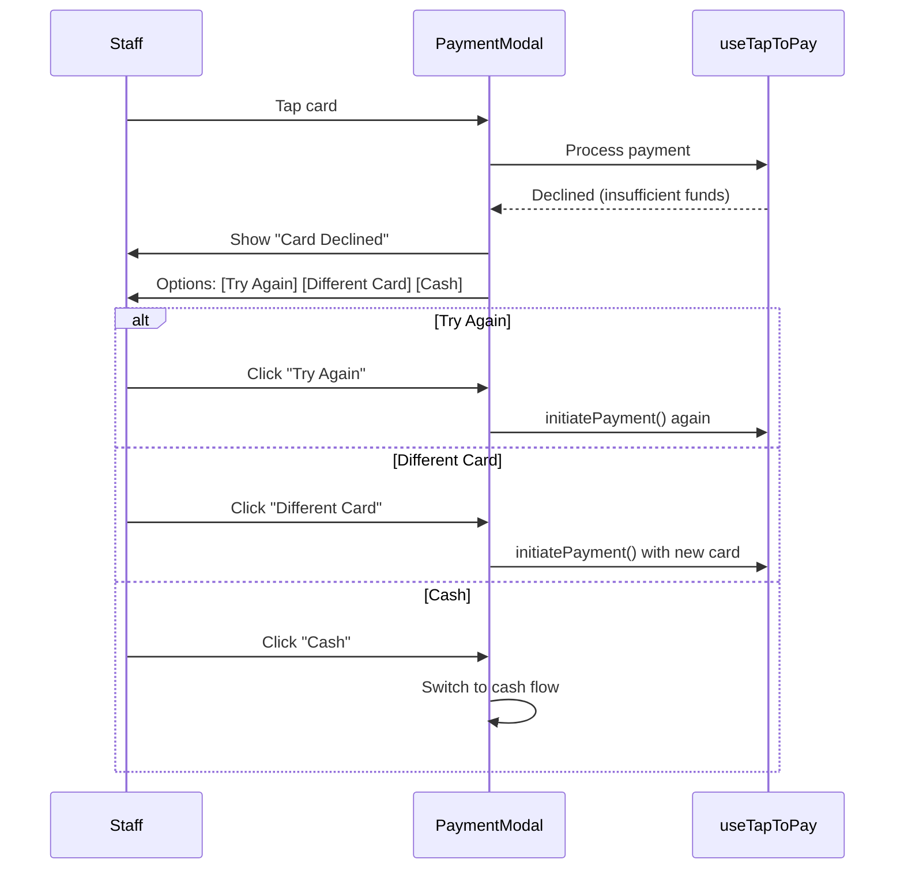

# Mango POS - Payment Integration Architecture

**Version:** 1.0.0 | **Last Updated:** December 27, 2025

---

## Table of Contents

1. [Overview](#1-overview)
2. [Payment Processor Chain](#2-payment-processor-chain)
3. [Tap to Pay Technology](#3-tap-to-pay-technology)
4. [Platform Architecture](#4-platform-architecture)
5. [Capacitor Integration](#5-capacitor-integration)
6. [Native Plugin Implementation](#6-native-plugin-implementation)
7. [React Hooks](#7-react-hooks)
8. [Credentials & Configuration](#8-credentials--configuration)
9. [Payment Flows](#9-payment-flows)
10. [Error Handling](#10-error-handling)
11. [Testing](#11-testing)
12. [Implementation Phases](#12-implementation-phases)

---

## 1. Overview

Mango POS integrates **Tap to Pay** (contactless card payments) using **Fiserv CommerceHub** via the existing **CardConnect** merchant account. This enables mobile devices to accept card payments directly using their NFC hardware - no external card reader required.

### Key Benefits

| Benefit | Description |
|---------|-------------|
| **No Hardware** | Phone becomes the payment terminal |
| **Lower Cost** | No monthly terminal rental fees |
| **Mobility** | Accept payments anywhere in the salon |
| **Same Rates** | Uses existing CardConnect processing rates |
| **Secure** | PCI-compliant, encrypted end-to-end |

### Technology Stack

```
┌─────────────────────────────────────────────────────────────────┐
│  React UI (PaymentModal.tsx)                                     │
├─────────────────────────────────────────────────────────────────┤
│  useTapToPay Hook                                                │
├─────────────────────────────────────────────────────────────────┤
│  Capacitor Bridge                                                │
├─────────────────────────────────────────────────────────────────┤
│  FiservTTPPlugin (iOS: Swift / Android: Kotlin)                  │
├─────────────────────────────────────────────────────────────────┤
│  FiservTTP SDK (iOS) / Fiserv TTP SDK (Android)                  │
├─────────────────────────────────────────────────────────────────┤
│  Fiserv CommerceHub API                                          │
├─────────────────────────────────────────────────────────────────┤
│  TSYS Payment Processor                                          │
└─────────────────────────────────────────────────────────────────┘
```

---

## 2. Payment Processor Chain

### Relationship Overview

```
CardConnect Account → Fiserv CommerceHub → TSYS Backend
        │                      │                  │
        │                      │                  └── Payment Processing
        │                      └── Developer Portal, SDKs, APIs
        └── Merchant Account, Credentials
```

### Background

- **CardConnect** was acquired by **First Data** in 2017
- **First Data** was acquired by **Fiserv** in 2019
- CardConnect credentials provide access to **Fiserv CommerceHub**
- Backend processing is handled by **TSYS**

### Access Points

| Portal | URL | Purpose |
|--------|-----|---------|
| CardConnect Portal | cardconnect.com | Merchant account management |
| Fiserv Developer Portal | developer.fiserv.com | SDK access, API docs, sandbox |
| CommerceHub Dashboard | Via Fiserv portal | Transaction monitoring |

---

## 3. Tap to Pay Technology

### What is Tap to Pay?

**Tap to Pay** (also called **SoftPOS** or **Tap on Phone**) turns NFC-enabled mobile devices into payment terminals. Customers tap their contactless card or mobile wallet on the phone screen to pay.

### Supported Payment Methods

| Method | iOS | Android |
|--------|-----|---------|
| Contactless Cards (Visa, MC, Amex, Discover) | ✅ | ✅ |
| Apple Pay | ✅ | ✅ |
| Google Pay | ✅ | ✅ |
| Samsung Pay | ✅ | ✅ |
| Chip & PIN | ❌ | ❌ |
| Magnetic Stripe | ❌ | ❌ |

### Device Requirements

#### iOS (Tap to Pay on iPhone)
| Requirement | Detail |
|-------------|--------|
| Device | iPhone XS or newer |
| iOS Version | 16.7 or later |
| Region | US, UK, Australia, Canada, France, etc. |
| NFC | Built-in |

#### Android
| Requirement | Detail |
|-------------|--------|
| Device | NFC-enabled smartphone |
| Android Version | 10 (API 29) or later |
| NFC | Required |
| Google Play Services | Required |

---

## 4. Platform Architecture

### Platform Detection

```typescript
// src/hooks/usePlatform.ts
import { Capacitor } from '@capacitor/core';

export type Platform = 'web' | 'ios' | 'android' | 'electron';

export const usePlatform = () => {
  const platform: Platform = (() => {
    if (typeof window !== 'undefined' && (window as any).electronAPI) {
      return 'electron';
    }
    if (Capacitor.isNativePlatform()) {
      return Capacitor.getPlatform() as 'ios' | 'android';
    }
    return 'web';
  })();

  return {
    platform,
    isNative: platform !== 'web',
    isCapacitor: platform === 'ios' || platform === 'android',
    isElectron: platform === 'electron',
    supportsTapToPay: platform === 'ios' || platform === 'android',
    supportsUsb: platform === 'electron',
  };
};
```

### Payment Method by Platform

| Platform | Primary Payment | Fallback |
|----------|-----------------|----------|
| iOS | Tap to Pay | External reader (Bluetooth) |
| Android | Tap to Pay | External reader (Bluetooth) |
| Web | None (redirect to mobile) | Manual entry via secure iframe |
| Electron | USB card reader | Manual entry |

---

## 5. Capacitor Integration

### Installation

```bash
# Install Capacitor core
npm install @capacitor/core @capacitor/cli

# Initialize Capacitor in project
npx cap init "Mango POS" "com.mangobiz.pos"

# Add mobile platforms
npm install @capacitor/ios @capacitor/android
npx cap add ios
npx cap add android

# Build and sync
npm run build
npx cap sync
```

### Configuration

```typescript
// capacitor.config.ts
import { CapacitorConfig } from '@capacitor/cli';

const config: CapacitorConfig = {
  appId: 'com.mangobiz.pos',
  appName: 'Mango POS',
  webDir: 'dist',
  bundledWebRuntime: false,
  plugins: {
    // Plugin configurations go here
  },
  ios: {
    scheme: 'Mango POS',
    contentInset: 'automatic',
  },
  android: {
    allowMixedContent: true,
  },
};

export default config;
```

### Project Structure After Capacitor Setup

```
mango-pos-offline-v2/
├── capacitor.config.ts          # Capacitor configuration
├── ios/                          # iOS Xcode project
│   ├── App/
│   │   ├── App.xcodeproj
│   │   ├── AppDelegate.swift
│   │   ├── Podfile               # CocoaPods dependencies
│   │   └── Plugins/
│   │       └── FiservTTPPlugin/
│   └── Podfile.lock
├── android/                      # Android Studio project
│   ├── app/
│   │   ├── build.gradle
│   │   └── src/main/
│   │       ├── java/com/mangobiz/pos/
│   │       │   └── FiservTTPPlugin.kt
│   │       └── AndroidManifest.xml
│   └── build.gradle
├── src/                          # Existing React source
├── dist/                         # Built web app (synced to native)
└── package.json
```

---

## 6. Native Plugin Implementation

### iOS Plugin (Swift)

```swift
// ios/App/Plugins/FiservTTPPlugin/FiservTTPPlugin.swift

import Foundation
import Capacitor
import FiservTTP  // Fiserv SDK

@objc(FiservTTPPlugin)
public class FiservTTPPlugin: CAPPlugin {

    private var cardReader: FiservTTPCardReader?

    @objc func initialize(_ call: CAPPluginCall) {
        guard let merchantId = call.getString("merchantId"),
              let apiKey = call.getString("apiKey"),
              let apiSecret = call.getString("apiSecret") else {
            call.reject("Missing credentials")
            return
        }

        let config = FiservTTPConfig(
            merchantId: merchantId,
            apiKey: apiKey,
            apiSecret: apiSecret,
            environment: .sandbox  // or .production
        )

        cardReader = FiservTTPCardReader(config: config)
        cardReader?.delegate = self

        call.resolve(["initialized": true])
    }

    @objc func readCard(_ call: CAPPluginCall) {
        guard let cardReader = cardReader else {
            call.reject("Plugin not initialized")
            return
        }

        guard let amount = call.getDouble("amount") else {
            call.reject("Amount required")
            return
        }

        let request = FiservTTPReadCardRequest(
            amount: Decimal(amount),
            currency: call.getString("currency") ?? "USD",
            transactionType: .sale
        )

        cardReader.readCard(request: request) { result in
            switch result {
            case .success(let response):
                call.resolve([
                    "approved": response.approved,
                    "transactionId": response.transactionId,
                    "authCode": response.authCode ?? "",
                    "cardLast4": response.cardLast4 ?? "",
                    "cardBrand": response.cardBrand ?? "",
                    "message": response.message ?? ""
                ])
            case .failure(let error):
                call.reject(error.localizedDescription)
            }
        }
    }

    @objc func cancelTransaction(_ call: CAPPluginCall) {
        cardReader?.cancelTransaction()
        call.resolve()
    }
}

extension FiservTTPPlugin: FiservTTPCardReaderDelegate {
    public func cardReaderDidBecomeReady() {
        notifyListeners("readerReady", data: [:])
    }

    public func cardReaderDidRequestCardPresentation() {
        notifyListeners("presentCard", data: [:])
    }

    public func cardReaderDidDetectCard() {
        notifyListeners("cardDetected", data: [:])
    }
}
```

### iOS Plugin Registration

```swift
// ios/App/Plugins/FiservTTPPlugin/FiservTTPPlugin.m
#import <Capacitor/Capacitor.h>

CAP_PLUGIN(FiservTTPPlugin, "FiservTTP",
    CAP_PLUGIN_METHOD(initialize, CAPPluginReturnPromise);
    CAP_PLUGIN_METHOD(readCard, CAPPluginReturnPromise);
    CAP_PLUGIN_METHOD(cancelTransaction, CAPPluginReturnPromise);
)
```

### iOS Podfile Dependencies

```ruby
# ios/App/Podfile

platform :ios, '16.0'
use_frameworks!

target 'App' do
  capacitor_pods

  # Fiserv TTP SDK
  pod 'FiservTTP', :git => 'https://github.com/Fiserv/TTPPackage.git'
end
```

### Android Plugin (Kotlin)

```kotlin
// android/app/src/main/java/com/mangobiz/pos/FiservTTPPlugin.kt

package com.mangobiz.pos

import com.getcapacitor.Plugin
import com.getcapacitor.PluginCall
import com.getcapacitor.PluginMethod
import com.getcapacitor.annotation.CapacitorPlugin
import com.fiserv.ttp.FiservTTPCardReader
import com.fiserv.ttp.FiservTTPConfig
import com.fiserv.ttp.FiservTTPReadCardRequest

@CapacitorPlugin(name = "FiservTTP")
class FiservTTPPlugin : Plugin() {

    private var cardReader: FiservTTPCardReader? = null

    @PluginMethod
    fun initialize(call: PluginCall) {
        val merchantId = call.getString("merchantId") ?: run {
            call.reject("merchantId required")
            return
        }
        val apiKey = call.getString("apiKey") ?: run {
            call.reject("apiKey required")
            return
        }
        val apiSecret = call.getString("apiSecret") ?: run {
            call.reject("apiSecret required")
            return
        }

        val config = FiservTTPConfig.Builder()
            .merchantId(merchantId)
            .apiKey(apiKey)
            .apiSecret(apiSecret)
            .environment(FiservTTPConfig.Environment.SANDBOX)
            .build()

        cardReader = FiservTTPCardReader(activity, config)

        call.resolve(mapOf("initialized" to true))
    }

    @PluginMethod
    fun readCard(call: PluginCall) {
        val reader = cardReader ?: run {
            call.reject("Plugin not initialized")
            return
        }

        val amount = call.getDouble("amount") ?: run {
            call.reject("amount required")
            return
        }

        val request = FiservTTPReadCardRequest.Builder()
            .amount(amount.toBigDecimal())
            .currency(call.getString("currency") ?: "USD")
            .transactionType(FiservTTPReadCardRequest.TransactionType.SALE)
            .build()

        reader.readCard(request) { result ->
            result.onSuccess { response ->
                call.resolve(mapOf(
                    "approved" to response.approved,
                    "transactionId" to response.transactionId,
                    "authCode" to (response.authCode ?: ""),
                    "cardLast4" to (response.cardLast4 ?: ""),
                    "cardBrand" to (response.cardBrand ?: ""),
                    "message" to (response.message ?: "")
                ))
            }
            result.onFailure { error ->
                call.reject(error.message)
            }
        }
    }

    @PluginMethod
    fun cancelTransaction(call: PluginCall) {
        cardReader?.cancelTransaction()
        call.resolve()
    }
}
```

---

## 7. React Hooks

### useTapToPay Hook

```typescript
// src/hooks/useTapToPay.ts

import { useState, useCallback, useEffect } from 'react';
import { registerPlugin } from '@capacitor/core';
import { usePlatform } from './usePlatform';

interface FiservTTPPlugin {
  initialize(options: {
    merchantId: string;
    apiKey: string;
    apiSecret: string;
  }): Promise<{ initialized: boolean }>;

  readCard(options: {
    amount: number;
    currency?: string;
    transactionType?: 'sale' | 'refund' | 'void';
  }): Promise<PaymentResult>;

  cancelTransaction(): Promise<void>;

  addListener(event: string, callback: () => void): Promise<void>;
}

export interface PaymentResult {
  approved: boolean;
  transactionId: string;
  authCode: string;
  cardLast4: string;
  cardBrand: string;
  message: string;
}

type PaymentStatus = 'idle' | 'initializing' | 'ready' | 'waiting_for_card' | 'processing' | 'success' | 'error';

const FiservTTP = registerPlugin<FiservTTPPlugin>('FiservTTP');

export const useTapToPay = () => {
  const { supportsTapToPay, platform } = usePlatform();
  const [status, setStatus] = useState<PaymentStatus>('idle');
  const [error, setError] = useState<string | null>(null);
  const [isInitialized, setIsInitialized] = useState(false);

  // Initialize SDK
  const initialize = useCallback(async (credentials: {
    merchantId: string;
    apiKey: string;
    apiSecret: string;
  }) => {
    if (!supportsTapToPay) {
      setError('Tap to Pay not supported on this platform');
      return false;
    }

    setStatus('initializing');
    try {
      await FiservTTP.initialize(credentials);
      setIsInitialized(true);
      setStatus('ready');

      // Listen for events
      FiservTTP.addListener('presentCard', () => {
        setStatus('waiting_for_card');
      });

      FiservTTP.addListener('cardDetected', () => {
        setStatus('processing');
      });

      return true;
    } catch (err) {
      setError(err instanceof Error ? err.message : 'Initialization failed');
      setStatus('error');
      return false;
    }
  }, [supportsTapToPay]);

  // Process payment
  const initiatePayment = useCallback(async (
    amount: number,
    options?: {
      currency?: string;
      transactionType?: 'sale' | 'refund' | 'void';
    }
  ): Promise<PaymentResult | null> => {
    if (!isInitialized) {
      setError('SDK not initialized');
      return null;
    }

    setStatus('processing');
    setError(null);

    try {
      const result = await FiservTTP.readCard({
        amount,
        currency: options?.currency ?? 'USD',
        transactionType: options?.transactionType ?? 'sale',
      });

      if (result.approved) {
        setStatus('success');
      } else {
        setError(result.message || 'Payment declined');
        setStatus('error');
      }

      return result;
    } catch (err) {
      setError(err instanceof Error ? err.message : 'Payment failed');
      setStatus('error');
      return null;
    }
  }, [isInitialized]);

  // Cancel payment
  const cancelPayment = useCallback(async () => {
    try {
      await FiservTTP.cancelTransaction();
      setStatus('ready');
    } catch (err) {
      // Ignore cancellation errors
    }
  }, []);

  // Reset state
  const reset = useCallback(() => {
    setStatus(isInitialized ? 'ready' : 'idle');
    setError(null);
  }, [isInitialized]);

  return {
    // State
    status,
    error,
    isInitialized,
    supportsTapToPay,
    platform,

    // Actions
    initialize,
    initiatePayment,
    cancelPayment,
    reset,

    // Computed
    isReady: status === 'ready',
    isProcessing: status === 'processing' || status === 'waiting_for_card',
    isSuccess: status === 'success',
    isError: status === 'error',
  };
};
```

### usePayment Hook (Unified)

```typescript
// src/hooks/usePayment.ts

import { useTapToPay, PaymentResult } from './useTapToPay';
import { usePlatform } from './usePlatform';

export interface PaymentRequest {
  amount: number;
  tip?: number;
  ticketId: string;
  method: 'tap_to_pay' | 'cash' | 'gift_card' | 'manual_entry';
}

export interface PaymentResponse {
  success: boolean;
  transactionId?: string;
  error?: string;
  details?: PaymentResult;
}

export const usePayment = () => {
  const { supportsTapToPay } = usePlatform();
  const tapToPay = useTapToPay();

  const processPayment = async (request: PaymentRequest): Promise<PaymentResponse> => {
    const totalAmount = request.amount + (request.tip ?? 0);

    switch (request.method) {
      case 'tap_to_pay':
        if (!supportsTapToPay) {
          return {
            success: false,
            error: 'Tap to Pay not available on this device',
          };
        }

        const result = await tapToPay.initiatePayment(totalAmount);

        if (result?.approved) {
          return {
            success: true,
            transactionId: result.transactionId,
            details: result,
          };
        } else {
          return {
            success: false,
            error: result?.message || 'Payment declined',
            details: result ?? undefined,
          };
        }

      case 'cash':
        // Cash handling is local-only
        return {
          success: true,
          transactionId: `cash_${Date.now()}`,
        };

      case 'gift_card':
        // Gift card validation would go here
        return {
          success: true,
          transactionId: `gc_${Date.now()}`,
        };

      default:
        return {
          success: false,
          error: 'Unsupported payment method',
        };
    }
  };

  return {
    processPayment,
    tapToPay,
    supportsTapToPay,
  };
};
```

---

## 8. Credentials & Configuration

### Required Credentials

| Credential | Source | Storage |
|------------|--------|---------|
| Merchant ID | CardConnect Portal | Environment variable |
| API Key | Fiserv Developer Portal | Environment variable |
| API Secret | Fiserv Developer Portal | Secure storage (encrypted) |
| Terminal ID | Fiserv (auto-generated per device) | Device local storage |

### Environment Variables

```bash
# .env (development)
VITE_FISERV_MERCHANT_ID=your_merchant_id
VITE_FISERV_API_KEY=your_api_key
VITE_FISERV_ENVIRONMENT=sandbox

# .env.production
VITE_FISERV_MERCHANT_ID=your_production_merchant_id
VITE_FISERV_API_KEY=your_production_api_key
VITE_FISERV_ENVIRONMENT=production
```

### Secure Secret Storage

API secrets should NOT be in environment variables. Use secure storage:

```typescript
// src/services/payment/credentials.ts

import { secureStorage } from '../secureStorage';

export const getPaymentCredentials = async () => {
  const merchantId = import.meta.env.VITE_FISERV_MERCHANT_ID;
  const apiKey = import.meta.env.VITE_FISERV_API_KEY;

  // API Secret stored securely (set during onboarding)
  const apiSecret = await secureStorage.getItem('fiserv_api_secret');

  if (!merchantId || !apiKey || !apiSecret) {
    throw new Error('Payment credentials not configured');
  }

  return { merchantId, apiKey, apiSecret };
};
```

---

## 9. Payment Flows

### Standard Tap to Pay Flow



### Payment Declined Flow



---

## 10. Error Handling

### Error Types

| Error Code | Description | User Message |
|------------|-------------|--------------|
| `DECLINED_INSUFFICIENT_FUNDS` | Card declined | "Card declined - insufficient funds" |
| `DECLINED_EXPIRED` | Expired card | "Card expired - please use another card" |
| `DECLINED_GENERIC` | General decline | "Card declined - please try another card" |
| `NFC_DISABLED` | NFC turned off | "Please enable NFC in settings" |
| `NFC_NOT_SUPPORTED` | No NFC hardware | "This device doesn't support Tap to Pay" |
| `TIMEOUT` | Card not presented | "Payment timed out - please try again" |
| `CANCELLED` | User cancelled | "Payment cancelled" |
| `NETWORK_ERROR` | Connection issue | "Network error - please check connection" |

### Error Handling in UI

```typescript
// In PaymentModal.tsx
const handlePaymentError = (error: string) => {
  switch (error) {
    case 'NFC_DISABLED':
      toast.error('Please enable NFC in your device settings');
      break;
    case 'TIMEOUT':
      toast.info('Payment timed out. Ready to try again.');
      break;
    case 'DECLINED_INSUFFICIENT_FUNDS':
      toast.error('Card declined - insufficient funds');
      setShowAlternatePayment(true);
      break;
    default:
      toast.error(error || 'Payment failed');
  }
};
```

---

## 11. Testing

### Sandbox Testing

Fiserv provides test cards for sandbox environment:

| Test Card | Number | Result |
|-----------|--------|--------|
| Approved | 4111 1111 1111 1111 | Approved |
| Declined | 4000 0000 0000 0002 | Declined |
| CVV Fail | 4000 0000 0000 0101 | CVV mismatch |
| Expired | 4000 0000 0000 0069 | Expired card |

### Testing Steps

1. **Sandbox Mode**
   - Use sandbox credentials from Fiserv Developer Portal
   - Test with physical NFC test cards or Apple Pay/Google Pay in sandbox

2. **Device Testing**
   - Test on real iOS device (iPhone XS+)
   - Test on real Android device with NFC
   - Test on simulator (limited - no NFC)

3. **Edge Cases**
   - NFC disabled during payment
   - Network loss during payment
   - App backgrounded during payment
   - Multiple rapid payment attempts

### Unit Tests

```typescript
// src/hooks/useTapToPay.test.ts

import { renderHook, act } from '@testing-library/react-hooks';
import { useTapToPay } from './useTapToPay';

// Mock Capacitor plugin
jest.mock('@capacitor/core', () => ({
  registerPlugin: () => ({
    initialize: jest.fn().mockResolvedValue({ initialized: true }),
    readCard: jest.fn().mockResolvedValue({
      approved: true,
      transactionId: 'test_123',
      authCode: '123456',
      cardLast4: '1111',
      cardBrand: 'VISA',
    }),
    cancelTransaction: jest.fn().mockResolvedValue(undefined),
    addListener: jest.fn().mockResolvedValue(undefined),
  }),
}));

describe('useTapToPay', () => {
  it('should initialize successfully', async () => {
    const { result } = renderHook(() => useTapToPay());

    await act(async () => {
      const success = await result.current.initialize({
        merchantId: 'test',
        apiKey: 'test',
        apiSecret: 'test',
      });
      expect(success).toBe(true);
    });

    expect(result.current.isInitialized).toBe(true);
    expect(result.current.status).toBe('ready');
  });

  it('should process payment successfully', async () => {
    const { result } = renderHook(() => useTapToPay());

    // Initialize first
    await act(async () => {
      await result.current.initialize({
        merchantId: 'test',
        apiKey: 'test',
        apiSecret: 'test',
      });
    });

    // Process payment
    let paymentResult;
    await act(async () => {
      paymentResult = await result.current.initiatePayment(100);
    });

    expect(paymentResult?.approved).toBe(true);
    expect(result.current.status).toBe('success');
  });
});
```

---

## 12. Implementation Phases

### Phase 1: Capacitor Setup (2-3 days)

- [ ] Install Capacitor core and CLI
- [ ] Initialize Capacitor with app config
- [ ] Add iOS and Android platforms
- [ ] Configure Xcode and Android Studio projects
- [ ] Verify web build syncs to native projects

### Phase 2: iOS Plugin (3-4 days)

- [ ] Add FiservTTP SDK via CocoaPods
- [ ] Create FiservTTPPlugin.swift
- [ ] Implement initialize, readCard, cancelTransaction
- [ ] Add plugin registration (FiservTTPPlugin.m)
- [ ] Test on physical iPhone device

### Phase 3: Android Plugin (3-4 days)

- [ ] Add Fiserv TTP SDK dependency
- [ ] Create FiservTTPPlugin.kt
- [ ] Implement same methods as iOS
- [ ] Register plugin in MainActivity
- [ ] Test on physical Android device

### Phase 4: React Integration (2-3 days)

- [ ] Create usePlatform hook
- [ ] Create useTapToPay hook
- [ ] Create usePayment hook (unified)
- [ ] Add unit tests for hooks
- [ ] Integrate with PaymentModal

### Phase 5: Testing & Polish (2-3 days)

- [ ] End-to-end testing with sandbox
- [ ] Error handling and edge cases
- [ ] UI polish (loading states, animations)
- [ ] Documentation updates
- [ ] Code review and cleanup

### Total Estimated Effort: 12-17 days

---

## Related Documentation

| Document | Description |
|----------|-------------|
| [TECHNICAL_DOCUMENTATION.md](./TECHNICAL_DOCUMENTATION.md) | Full technical architecture |
| [PRD-Sales-Checkout-Module.md](../product/PRD-Sales-Checkout-Module.md) | Sales & checkout requirements |
| [DATA_STORAGE_STRATEGY.md](./DATA_STORAGE_STRATEGY.md) | Data storage and sync |

## External Resources

| Resource | URL |
|----------|-----|
| Fiserv Developer Portal | https://developer.fiserv.com |
| CommerceHub Docs | https://developer.fiserv.com/product/CommerceHub |
| FiservTTP iOS SDK | https://github.com/Fiserv/TTPPackage |
| FiservTTP iOS Sample | https://github.com/Fiserv/TTPSampleApp |
| Android TTP Sample | https://github.com/Fiserv/ch-ttp-android-sample-app |
| Capacitor Docs | https://capacitorjs.com/docs |

---

*Generated: December 27, 2025*
