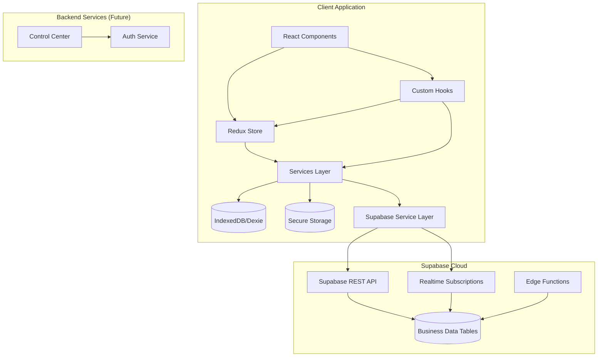
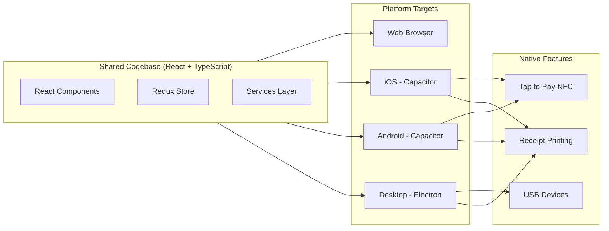
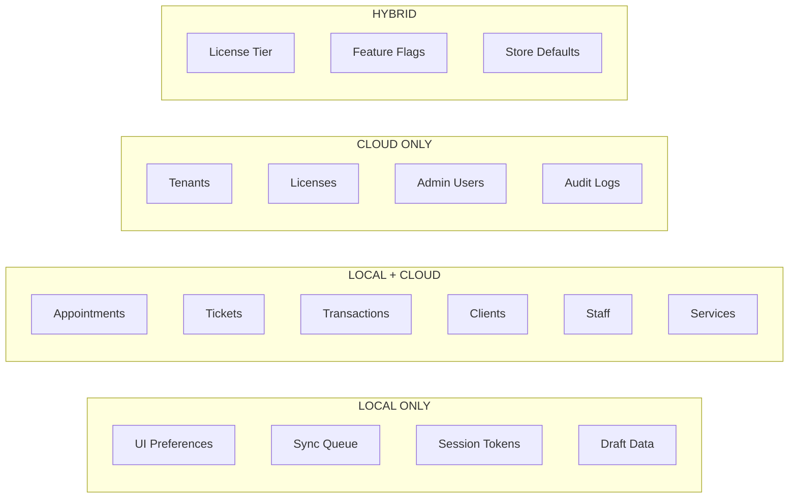
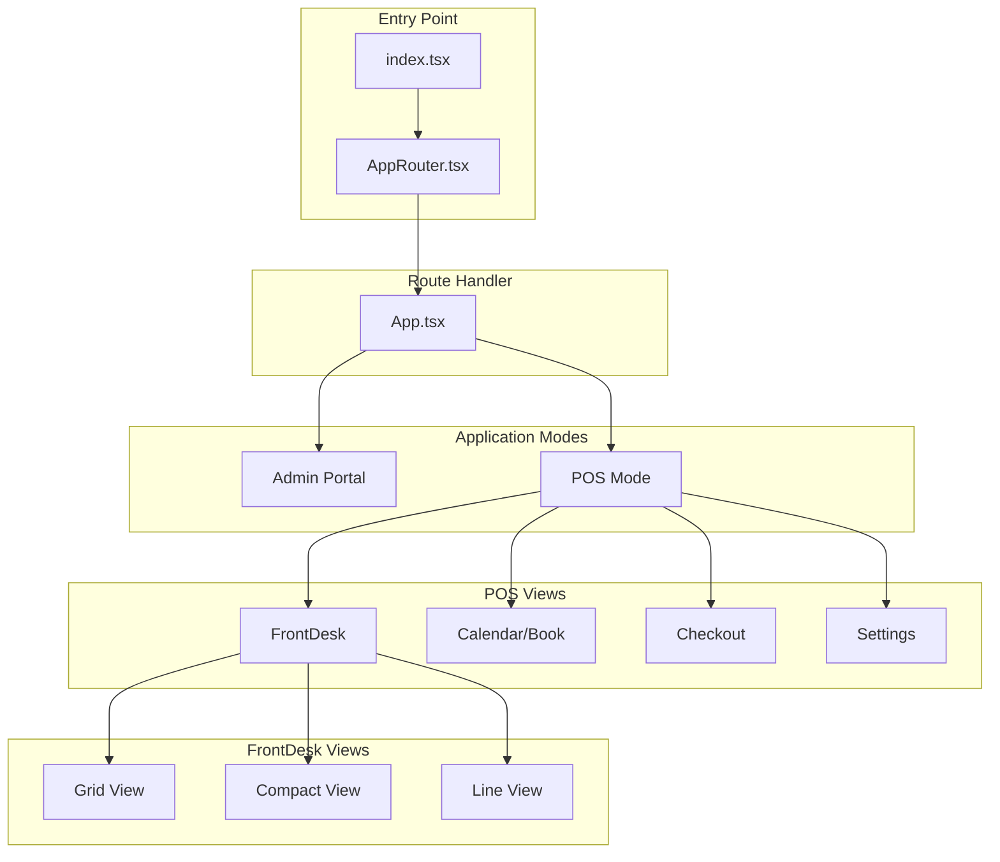
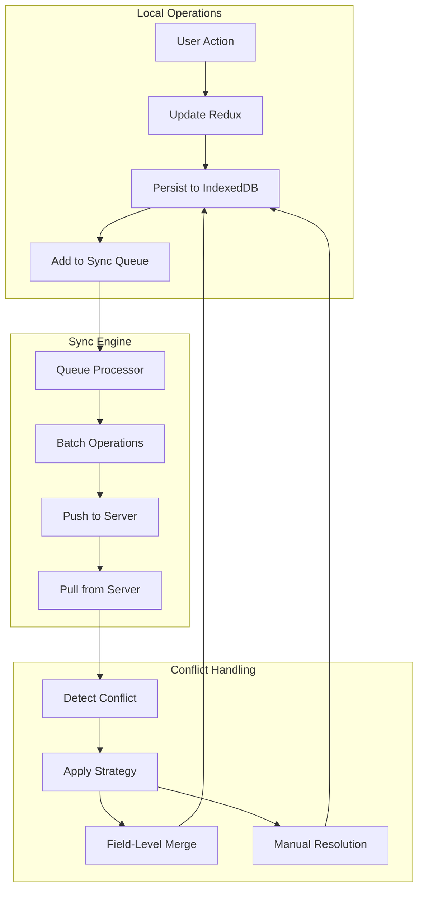
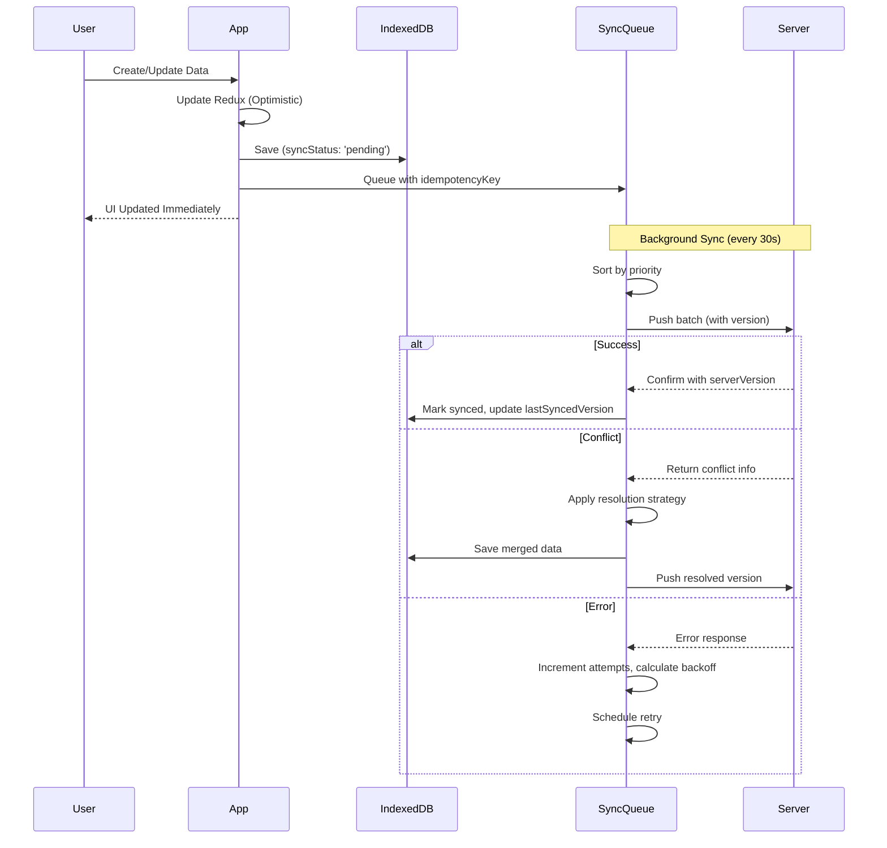
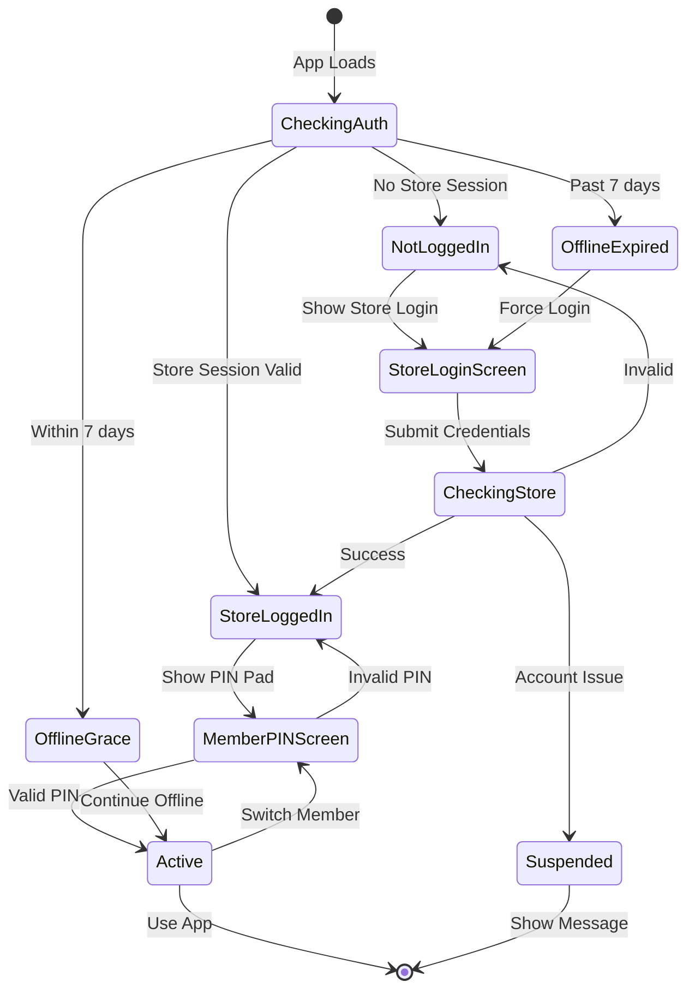
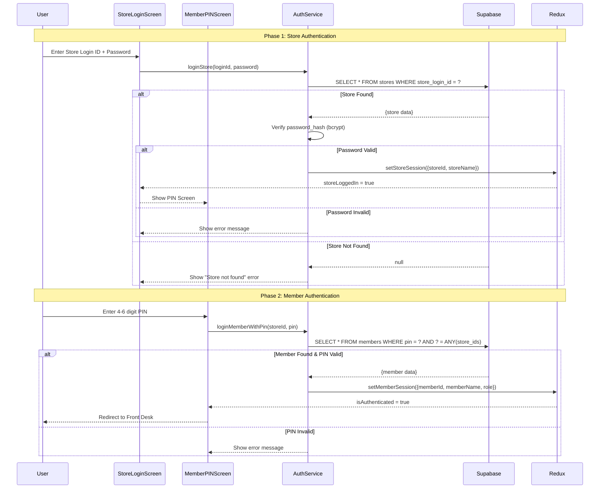
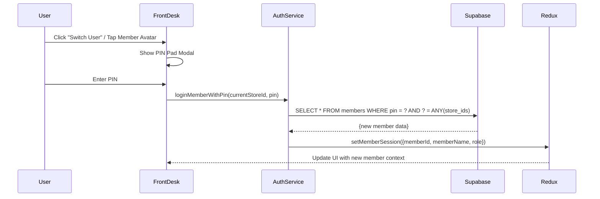
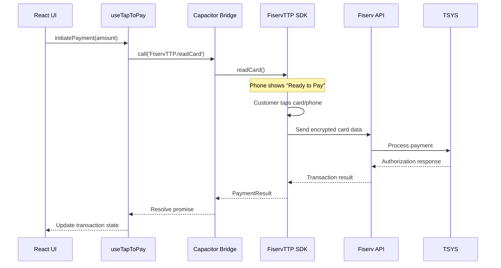

# Mango POS Offline V2 - Technical Documentation

**Version:** 2.4.0 | **Last Updated:** December 27, 2025

---

## Table of Contents

1. [System Overview](#system-overview)
2. [High-Level Architecture](#high-level-architecture)
3. [Technology Stack](#technology-stack)
4. [Monorepo Architecture](#monorepo-architecture)
5. [Real-time Communication](#real-time-communication)
6. [Native Platform Architecture](#native-platform-architecture)
7. [Data Storage Strategy](#data-storage-strategy)
8. [Component Hierarchy](#component-hierarchy)
9. [State Management (Redux)](#state-management-redux)
10. [Database Schema (IndexedDB)](#database-schema-indexeddb)
11. [Offline Sync System](#offline-sync-system)
12. [Authentication Flow](#authentication-flow)
13. [API Integration](#api-integration)
14. [Payment Integration](#payment-integration)
15. [File Structure](#file-structure)
16. [Security Architecture](#security-architecture)

---

## System Overview

Mango POS is an offline-first salon management system built with React, TypeScript, and IndexedDB. It provides comprehensive salon operations including appointment scheduling, ticket management, payment processing, and staff coordination - all designed to work seamlessly without internet connectivity.

### Key Capabilities

- Appointment booking with smart staff assignment
- Real-time ticket management
- Offline-first data persistence with intelligent sync
- Multi-view front desk (Grid, Compact, Line)
- Turn tracking for staff rotation
- Payment processing and receipts
- Admin portal for multi-store management

### Design Principles

| Principle | Description |
|-----------|-------------|
| **Offline-First** | All operations work without internet; local storage is primary |
| **Optimistic UI** | Immediate feedback on all actions |
| **Automatic Sync** | Background sync with priority-based queue |
| **Smart Conflict Resolution** | Field-level merging with configurable strategies per entity |
| **Mobile Responsive** | Works on all device sizes |
| **PWA Ready** | Installable as native app |
| **Audit Everything** | All mutations traceable to user, device, and time |

---

## High-Level Architecture



### Supabase Direct Sync Architecture

**Status:** Implemented (Phase 1-5 Complete)

Business data (clients, staff, services, appointments, tickets, transactions) now syncs directly to Supabase without requiring a backend API. This simplifies the architecture and enables:

- **Direct database access** via Supabase JavaScript client
- **Real-time subscriptions** for multi-device sync
- **Row-Level Security (RLS)** for data isolation per store
- **Edge Functions** for complex operations (payments, SMS, reports)

```
src/services/supabase/
├── client.ts              # Supabase client configuration
├── types.ts               # Database type definitions
├── index.ts               # Main export
├── sync.ts                # Sync service with real-time subscriptions
├── adapters/              # Type conversion layer
│   ├── index.ts           # Export all adapters
│   ├── appointmentAdapter.ts  # AppointmentRow ↔ Appointment ✅
│   ├── clientAdapter.ts       # ClientRow ↔ Client ✅
│   ├── staffAdapter.ts        # StaffRow ↔ Staff ✅
│   ├── serviceAdapter.ts      # ServiceRow ↔ Service ✅
│   ├── ticketAdapter.ts       # TicketRow ↔ Ticket ✅
│   └── transactionAdapter.ts  # TransactionRow ↔ Transaction ✅
└── tables/
    ├── clientsTable.ts    # Clients CRUD operations
    ├── staffTable.ts      # Staff CRUD operations
    ├── servicesTable.ts   # Services CRUD operations
    ├── appointmentsTable.ts # Appointments CRUD operations
    ├── ticketsTable.ts    # Tickets CRUD operations
    └── transactionsTable.ts # Transactions CRUD operations
```

### dataService Pattern (Phase 6 - In Progress)

The `dataService` (`src/services/dataService.ts`) provides a unified API that routes data operations based on device mode:

```typescript
// Data flow based on device mode:
// Online-Only:  Redux Thunk → dataService → Supabase → Redux State
// Offline-Enabled: Redux Thunk → dataService → IndexedDB → Sync Queue → Supabase

import { dataService } from '@/services/dataService';

// Example usage in Redux thunks:
const appointments = await dataService.appointments.getByDate(date);
const newClient = await dataService.clients.create(clientData);
```

**Key Methods:**
| Entity | Read Methods | Write Methods |
|--------|--------------|---------------|
| `appointments` | `getByDate()`, `getUpcoming()`, `getById()` | `create()`, `update()`, `delete()` |
| `clients` | `getAll()`, `search()`, `getById()` | `create()`, `update()`, `delete()` |
| `staff` | `getActive()`, `getById()` | `create()`, `update()`, `delete()` |
| `tickets` | `getOpen()`, `getByDate()` | `create()`, `update()`, `complete()` |
| `transactions` | `getByTicket()`, `getByDate()` | `create()`, `void()`, `refund()` |
| `services` | `getActive()`, `getByCategory()` | `create()`, `update()`, `delete()` |

### Type Adapter Pattern

Type adapters convert between Supabase row types (snake_case) and application types (camelCase):

```typescript
// src/services/supabase/adapters/appointmentAdapter.ts

// Convert Supabase row to app type
export function toAppointment(row: AppointmentRow): Appointment {
  return {
    id: row.id,
    salonId: row.store_id,           // snake_case → camelCase
    clientName: row.client_name,
    scheduledStartTime: new Date(row.scheduled_start_time),
    // ... more field mappings
  };
}

// Convert app type to Supabase insert
export function toAppointmentInsert(appointment: Appointment): AppointmentInsert {
  return {
    store_id: appointment.salonId,   // camelCase → snake_case
    client_name: appointment.clientName,
    scheduled_start_time: appointment.scheduledStartTime.toISOString(),
    // ... more field mappings
  };
}

// Batch conversion
export function toAppointments(rows: AppointmentRow[]): Appointment[] {
  return rows.map(toAppointment);
}
```

**Adapter Functions per Entity:**
| Adapter | To App Type | To Insert | To Update |
|---------|-------------|-----------|-----------|
| `appointmentAdapter` | `toAppointment()` | `toAppointmentInsert()` | `toAppointmentUpdate()` |
| `clientAdapter` | `toClient()` | `toClientInsert()` | `toClientUpdate()` |
| `staffAdapter` | `toStaff()` | `toStaffInsert()` | `toStaffUpdate()` |
| `ticketAdapter` | `toTicket()` | `toTicketInsert()` | `toTicketUpdate()` |
| `transactionAdapter` | `toTransaction()` | `toTransactionInsert()` | `toTransactionUpdate()` |
| `serviceAdapter` | `toService()` | `toServiceInsert()` | `toServiceUpdate()` |

### Architecture Layers

| Layer | Responsibility | Key Files |
|-------|----------------|-----------|
| **Presentation** | React components, UI rendering, user interactions | `src/components/`, `src/pages/` |
| **State** | Redux store, slices, selectors, async thunks | `src/store/` |
| **Business Logic** | Services, utilities, hooks for business rules | `src/services/`, `src/hooks/`, `src/utils/` |
| **Supabase** | Cloud database operations, real-time sync | `src/services/supabase/` |
| **Data** | IndexedDB operations, sync queue | `src/db/` |
| **Security** | Encrypted storage, auth tokens, data isolation | `src/services/secureStorage.ts` |

---

## Technology Stack

### Core Framework & Language

| Technology | Version | Purpose |
|------------|---------|---------|
| **React** | 18.3.1 | UI Framework with Hooks |
| **TypeScript** | 5.5.4 | Type-safe JavaScript |
| **Vite** | 5.2.0 | Build Tool & Dev Server |

### State Management & Data

| Technology | Version | Purpose |
|------------|---------|---------|
| **Redux Toolkit** | 2.9.1 | Global state management |
| **React Redux** | 9.2.0 | React bindings for Redux |
| **TanStack React Query** | 5.90.11 | Server state & caching |
| **Dexie.js** | 4.2.1 | IndexedDB wrapper (offline storage) |
| **@supabase/supabase-js** | 2.84.0 | Supabase JavaScript client |

### Cloud Services

| Technology | Purpose |
|------------|---------|
| **Supabase** | PostgreSQL database, Auth, Real-time subscriptions, RLS |
| **Supabase Edge Functions** | Serverless functions (Deno) |

### UI Components & Styling

| Technology | Version | Purpose |
|------------|---------|---------|
| **Tailwind CSS** | 3.4.17 | Utility-first CSS |
| **Radix UI** | Various | Accessible headless components |
| **Lucide React** | 0.522.0 | Icon library |
| **Framer Motion** | 12.23.24 | Animations |
| **Recharts** | 3.4.1 | Data visualization/charts |
| **Sonner** | 2.0.7 | Toast notifications |
| **cmdk** | 1.1.1 | Command palette |
| **Vaul** | 1.1.2 | Drawer component |

### Forms & Validation

| Technology | Version | Purpose |
|------------|---------|---------|
| **React Hook Form** | 7.65.0 | Form state management |
| **Zod** | 3.25.76 | Schema validation |
| **@hookform/resolvers** | 3.10.0 | Zod + RHF integration |

### Date & Time

| Technology | Version | Purpose |
|------------|---------|---------|
| **date-fns** | 4.1.0 | Date manipulation |
| **Day.js** | 1.11.18 | Lightweight date library |
| **React Day Picker** | 9.11.3 | Calendar date picker |

### Routing & Navigation

| Technology | Version | Purpose |
|------------|---------|---------|
| **React Router DOM** | 7.9.6 | Client-side routing |

### Real-time Communication

| Technology | Version | Purpose |
|------------|---------|---------|
| **MQTT.js** | 5.x | MQTT client for device communication |
| **Mosquitto** | 2.x | Local MQTT broker (embedded in Store App) |
| **Supabase Realtime** | (via supabase-js) | Postgres change subscriptions |

### Testing

| Technology | Version | Purpose |
|------------|---------|---------|
| **Vitest** | 1.6.1 | Unit test runner |
| **Playwright** | 1.56.1 | E2E testing |
| **Testing Library** | 14.3.1 | React component testing |
| **fake-indexeddb** | 6.2.4 | IndexedDB mocking |

### Utilities

| Technology | Version | Purpose |
|------------|---------|---------|
| **uuid** | 9.0.1 | UUID generation |
| **clsx** | 2.1.1 | Conditional classnames |
| **tailwind-merge** | 3.4.0 | Tailwind class merging |
| **class-variance-authority** | 0.7.1 | Component variants |
| **Axios** | 1.12.2 | HTTP client |
| **Web Crypto API** | Native | AES-256-GCM encryption |

### Supabase Configuration

| Setting | Value |
|---------|-------|
| **Project URL** | `https://cpaldkcvdcdyzytosntc.supabase.co` |
| **Client Location** | `src/services/supabase/client.ts` |
| **Auto Refresh Token** | Enabled |
| **Persist Session** | Enabled |
| **Realtime Rate** | 10 events/second |

---

## Monorepo Architecture

Mango POS uses a **monorepo structure** with Turborepo + pnpm workspaces to manage multiple applications and shared packages.

### Directory Structure

```
mango-pos/
├── apps/
│   ├── store-app/          # Main POS (Electron + React)
│   ├── online-store/       # Customer booking (Next.js)
│   ├── check-in/           # Walk-in kiosk (React + Capacitor)
│   ├── mango-pad/          # Signature iPad (React + Capacitor)
│   └── client-portal/      # Client self-service (Next.js)
├── services/
│   └── cloud-mqtt/         # Cloud MQTT broker configuration
├── packages/
│   ├── types/              # @mango/types - Shared TypeScript types
│   ├── database/           # @mango/database - Supabase client
│   ├── utils/              # @mango/utils - Shared utilities
│   ├── ui/                 # @mango/ui - Shared components
│   └── mqtt-client/        # @mango/mqtt-client - MQTT wrapper
└── supabase/
    └── functions/          # Edge Functions
```

### Applications

| App | Platform | Purpose |
|-----|----------|---------|
| **Store App** | Electron + React | Main POS, runs local Mosquitto MQTT broker |
| **Online Store** | Next.js | Customer booking portal |
| **Check-In** | React + Capacitor | Walk-in registration kiosk |
| **Mango Pad** | React + Capacitor | Signature capture iPad |
| **Client Portal** | Next.js | Client self-service |

> **Full Documentation:** [MONOREPO_ARCHITECTURE.md](./MONOREPO_ARCHITECTURE.md)

---

## Real-time Communication

Mango POS uses **MQTT** (Message Queuing Telemetry Transport) for real-time device communication with a dual-broker architecture:

### Architecture

```
┌─────────────────────────────────────────────────────────────────┐
│                     SALON LOCAL NETWORK                          │
│                                                                  │
│   Check-In ◄──── LOCAL (2-10ms) ────► Store App (Mosquitto)     │
│   Mango Pad ◄─── LOCAL (2-10ms) ────► Port 1883                 │
│   Staff Tablet ◄ LOCAL (2-10ms) ───►                            │
│                                                                  │
└─────────────────────────────────────────────────────────────────┘
                              │
                     CLOUD (30-80ms)
                              │
┌─────────────────────────────────────────────────────────────────┐
│   Online Store ◄──────────► Cloud MQTT Broker (HiveMQ/EMQX)     │
│   Client Portal ◄─────────► Port 8883 (TLS)                     │
└─────────────────────────────────────────────────────────────────┘
```

### Key Topics & QoS

| Topic | QoS | Latency | Description |
|-------|-----|---------|-------------|
| `salon/{id}/pad/signature` | 1 | <50ms | Customer signature from Mango Pad |
| `salon/{id}/checkin/client` | 1 | <100ms | Walk-in from Check-In App |
| `salon/{id}/appointments/updated` | 1 | <200ms | Appointment changes |
| `salon/{id}/tickets/created` | 1 | <200ms | New ticket opened |
| `salon/{id}/payments/completed` | 2 | <200ms | Payment processed (exactly-once) |
| `salon/{id}/bookings/created` | 1 | <500ms | Online booking (cloud) |

### QoS Levels

| Level | Guarantee | Use Case |
|-------|-----------|----------|
| **0** | At most once | Non-critical UI updates |
| **1** | At least once | Signatures, check-ins, appointments |
| **2** | Exactly once | Financial transactions (payments) |

### Reliability

- **Local broker (Mosquitto):** 99% uptime
- **Cloud broker:** 99.6% uptime
- **Combined:** 99.96% (at least one available)
- **Built-in message queue:** QoS 1/2 auto-retries on disconnect

> **Full Documentation:** [REALTIME_COMMUNICATION.md](./REALTIME_COMMUNICATION.md)

---

## Native Platform Architecture

Mango POS supports multiple deployment platforms using a shared React codebase with platform-specific native shells.

### Platform Overview



### Capacitor Integration (iOS & Android)

**Capacitor** wraps the React web app in a native iOS/Android shell, enabling access to device-native APIs like NFC for Tap to Pay.

| Component | Technology | Purpose |
|-----------|------------|---------|
| **Web Layer** | React + Vite (WebView) | UI and business logic |
| **Native Bridge** | Capacitor Core | JavaScript ↔ Native communication |
| **iOS Native** | Swift/Xcode | FiservTTP SDK, NFC access |
| **Android Native** | Kotlin/Android Studio | Fiserv TTP SDK, NFC access |

**Project Structure (Future)**:
```
capacitor.config.ts        # Capacitor configuration
ios/                       # iOS Xcode project (generated)
├── App/
│   ├── AppDelegate.swift
│   └── Plugins/
│       └── FiservTTPPlugin/
│           ├── FiservTTPPlugin.swift
│           └── FiservTTPPlugin.m
android/                   # Android Studio project (generated)
├── app/src/main/
│   ├── java/com/mangobiz/pos/
│   │   └── FiservTTPPlugin.kt
│   └── res/
```

**Capacitor Setup Commands**:
```bash
npm install @capacitor/core @capacitor/cli
npx cap init "Mango POS" "com.mangobiz.pos"
npm install @capacitor/ios @capacitor/android
npx cap add ios
npx cap add android
npm run build && npx cap sync
```

### Electron Integration (Desktop)

**Electron** packages the React app for desktop deployment with access to USB peripherals.

| Component | Technology | Purpose |
|-----------|------------|---------|
| **Renderer** | React + Vite (Chromium) | UI layer |
| **Main Process** | Node.js | System access, IPC |
| **Preload** | Contextual Bridge | Secure API exposure |
| **Native** | Node.js addons | USB device drivers |

**Project Structure (Future)**:
```
electron/
├── main.ts               # Main process entry
├── preload.ts            # Secure bridge to renderer
├── plugins/
│   ├── UsbDevicePlugin.ts
│   └── PrinterPlugin.ts
└── build/
    └── electron-builder.yml
```

### Platform Detection Hook

Components can adapt behavior based on current platform:

```typescript
// src/hooks/usePlatform.ts (Future)
import { Capacitor } from '@capacitor/core';

export type Platform = 'web' | 'ios' | 'android' | 'electron';

export const usePlatform = () => {
  const platform: Platform = (() => {
    if (typeof window !== 'undefined' && (window as any).electronAPI) {
      return 'electron';
    }
    if (Capacitor.isNativePlatform()) {
      return Capacitor.getPlatform() as 'ios' | 'android';
    }
    return 'web';
  })();

  return {
    platform,
    isNative: platform !== 'web',
    isCapacitor: platform === 'ios' || platform === 'android',
    isElectron: platform === 'electron',
    supportsTapToPay: platform === 'ios' || platform === 'android',
    supportsUsb: platform === 'electron',
  };
};
```

### Platform-Specific Capabilities Matrix

| Capability | Web | iOS | Android | Electron |
|------------|-----|-----|---------|----------|
| **Tap to Pay (NFC)** | ❌ | ✅ iPhone XS+ | ✅ NFC-enabled | ❌ |
| **External Card Reader** | ❌ | Bluetooth | Bluetooth | ✅ USB |
| **Receipt Printer** | Browser Print | ESC/POS BT/WiFi | ESC/POS BT/WiFi | ESC/POS USB |
| **Cash Drawer** | ❌ | Via Printer | Via Printer | ✅ Serial/USB |
| **Barcode Scanner** | Camera | Native/Camera | Native/Camera | ✅ USB HID |
| **Offline Storage** | IndexedDB | IndexedDB | IndexedDB | IndexedDB + File |
| **Background Sync** | Service Worker | Background Tasks | Background Tasks | Node.js |

---

## Data Storage Strategy

> **Complete Reference:** See [DATA_STORAGE_STRATEGY.md](./DATA_STORAGE_STRATEGY.md) for comprehensive implementation details including schemas, sync architecture, conflict resolution, and security.

### Overview

Data is categorized into four storage types based on sync requirements, security, and access patterns.

### Supabase Business Tables (Implemented)

The following tables exist in Supabase for direct cloud sync:

| Table | Purpose | Key Fields | RLS |
|-------|---------|------------|-----|
| `clients` | Customer records | first_name, last_name, email, phone, is_vip | Enabled |
| `staff` | Team members | first_name, last_name, role, status, service_ids | Enabled |
| `services` | Service catalog | name, category_id, duration, price | Enabled |
| `appointments` | Scheduled bookings | client_id, staff_id, scheduled_start, status | Enabled |
| `tickets` | Service tickets | client_id, appointment_id, services, total | Enabled |
| `transactions` | Payment records | ticket_id, payment_method, amount, status | Enabled |

All tables include sync metadata fields:
- `sync_status`: 'local' | 'synced' | 'pending' | 'conflict' | 'error'
- `sync_version`: Monotonic counter for conflict detection
- `store_id`: Multi-tenant isolation
- `created_at`, `updated_at`: Timestamps



### Storage Categories Summary

| Category | Count | Key Points |
|----------|-------|------------|
| **Local Only** | 9 types | UI prefs, sync queue, tokens, drafts, device state |
| **Local + Cloud** | 7 entities | Appointments, Tickets, Transactions, Clients, Staff, Services, Products |
| **Cloud Only** | 12+ tables | Tenants, Licenses, Admin, Audit Logs, Feature Flags |
| **Hybrid (Cached)** | 7 types | License tier, Store defaults, Feature flags, Permissions |

### Sync Priorities

| Priority | Level | Entities | Description |
|----------|-------|----------|-------------|
| **CRITICAL** | 1 | Transactions, Payments | Must sync immediately when online |
| **HIGH** | 2 | Appointments, Tickets | Business-critical operations |
| **NORMAL** | 3 | Clients, Staff | Important but deferrable |
| **LOW** | 4 | Services, Products | Reference data |
| **BACKGROUND** | 5 | Analytics, Preferences | Sync when idle |

### Conflict Resolution Strategies

| Entity | Strategy | Key Rules |
|--------|----------|-----------|
| **Appointments** | Field-Merge | Status: latest, Notes: concat, Services: merge arrays |
| **Tickets** | Field-Merge | Payments: server-wins, Line items: merge arrays |
| **Transactions** | Server-Wins | All fields - financial data integrity |
| **Clients** | Field-Merge | Visits/Spend: max, Tags: merge arrays |
| **Staff** | Last-Write-Wins | Real-time fields: server-wins |
| **Services/Products** | Server-Wins | Reference data - server authoritative |

> **Implementation Details:** See [Section 4: Conflict Resolution](./DATA_STORAGE_STRATEGY.md#4-conflict-resolution) for complete conflict detection and resolution algorithms.

---

## Component Hierarchy



### Key Components

| Component | Size | Purpose |
|-----------|------|---------|
| `FrontDesk.tsx` | ~1004 lines | Main front desk screen with view switching |
| `StaffCard.tsx` | ~3500+ lines | Complex staff card with appointments/tickets |
| `FrontDeskSettings.tsx` | ~96KB | Comprehensive settings panel |
| `Checkout.tsx` | ~800+ lines | Payment processing flow |

---

## State Management (Redux)

### Store Structure

```typescript
{
  appointments: AppointmentsState,
  tickets: TicketsState,
  transactions: TransactionsState,
  staff: StaffState,
  clients: ClientsState,
  services: ServicesState,
  auth: AuthState,
  sync: SyncState,
  ui: UIState
}
```

### Slice Pattern

Each entity slice follows this pattern:

```typescript
interface EntityState<T> {
  items: T[];
  selectedId: string | null;
  loading: boolean;
  error: string | null;
  filters: FilterState;
  lastFetched: string | null;
}
```

### Key Slices

| Slice | Async Thunks | Selectors |
|-------|--------------|-----------|
| `appointmentsSlice` | fetchAppointments, createAppointment, updateAppointment | selectTodayAppointments, selectByStaff |
| `ticketsSlice` | fetchTickets, createTicket, updateTicket | selectOpenTickets, selectByClient |
| `syncSlice` | pushChanges, pullChanges, resolveConflict | selectPendingCount, selectSyncStatus |
| `authSlice` | loginStore, logout, validateSession | selectIsAuthenticated, selectCurrentStore |

### Redux → dataService Integration Pattern (Phase 6)

Redux slices should use `dataService` instead of calling IndexedDB or Supabase directly:

```typescript
// src/store/slices/appointmentsSlice.ts

import { dataService } from '@/services/dataService';
import { toAppointments, toAppointmentInsert } from '@/services/supabase/adapters';

// Fetch appointments via dataService
export const fetchAppointmentsFromSupabase = createAsyncThunk(
  'appointments/fetchFromSupabase',
  async (date: Date) => {
    const rows = await dataService.appointments.getByDate(date);
    return toAppointments(rows);  // Convert Supabase rows to app types
  }
);

// Create appointment via dataService
export const createAppointmentInSupabase = createAsyncThunk(
  'appointments/createInSupabase',
  async (appointment: Omit<Appointment, 'id' | 'createdAt' | 'updatedAt'>) => {
    const insertData = toAppointmentInsert(appointment);
    const row = await dataService.appointments.create(insertData);
    return toAppointment(row);
  }
);
```

**Migration Path:**
1. Add new Supabase-based thunks (e.g., `fetchAppointmentsFromSupabase`)
2. Keep existing IndexedDB thunks during transition
3. Update components to use new thunks
4. Deprecate old thunks once migration complete

---

## Database Schema (IndexedDB)

### Schema Definition (Dexie.js)

```typescript
db.version(3).stores({
  appointments: 'id, storeId, clientId, staffId, status, scheduledStartTime, [storeId+status], [storeId+scheduledStartTime], [staffId+scheduledStartTime], [clientId+createdAt], [storeId+isDeleted]',

  tickets: 'id, ticketNumber, storeId, clientId, appointmentId, status, createdAt, [storeId+status], [storeId+createdAt], [clientId+createdAt]',

  transactions: 'id, ticketId, ticketNumber, storeId, clientId, status, paymentMethod, createdAt, [storeId+createdAt], [storeId+status], [clientId+createdAt]',

  clients: 'id, storeId, email, phone, displayName, lastVisitAt, [storeId+displayName], [storeId+phone], [storeId+email], [storeId+lastVisitAt], [storeId+isDeleted]',

  staff: 'id, storeId, email, role, status, [storeId+status], [storeId+role], [storeId+isDeleted]',

  services: 'id, storeId, categoryId, isActive, displayOrder, [storeId+categoryId], [storeId+isActive], [storeId+isDeleted]',

  products: 'id, storeId, sku, barcode, categoryId, isActive, [storeId+categoryId], [storeId+isActive], [storeId+isDeleted]',

  syncQueue: '++localId, id, entity, entityId, status, priority, createdAt, [status+priority], [entity+entityId]',

  syncMeta: 'entity',
  conflicts: 'id, entityType, entityId, status, createdAt, [status+createdAt]',
  syncErrors: '++localId, entity, entityId, createdAt',
  cache: 'key, expiresAt',
  settings: 'key',
});
```

### Base Entity Interface

All synced entities extend this base:

```typescript
interface BaseSyncableEntity {
  id: string;                         // UUID v4
  tenantId: string;
  storeId: string;
  locationId?: string;

  // Sync metadata
  syncStatus: 'local' | 'synced' | 'pending' | 'syncing' | 'conflict' | 'error';
  version: number;                    // Monotonic counter
  vectorClock: Record<string, number>; // { deviceId: lastSeenVersion }
  lastSyncedVersion: number;

  // Timestamps
  createdAt: string;                  // ISO 8601
  updatedAt: string;

  // Audit trail
  createdBy: string;
  createdByDevice: string;
  lastModifiedBy: string;
  lastModifiedByDevice: string;

  // Soft delete (tombstone)
  isDeleted: boolean;
  deletedAt?: string;
  deletedBy?: string;
  deletedByDevice?: string;
  tombstoneExpiresAt?: string;
}
```

> **Complete Schemas:** See [Section 2: Core Entity Schemas](./DATA_STORAGE_STRATEGY.md#2-core-entity-schemas) for full TypeScript interfaces for all entities.

---

## Offline Sync System

### Sync Architecture



### Sync Configuration

| Setting | Value | Description |
|---------|-------|-------------|
| Sync Interval | 30 seconds | Background sync frequency |
| Batch Size | 50 operations | Max operations per sync |
| Max Retries | 5 attempts | With exponential backoff |
| Initial Backoff | 1 second | First retry delay |
| Max Backoff | 5 minutes | Maximum retry delay |
| Jitter Factor | 10% | Random delay to prevent thundering herd |
| Offline Grace | 7 days | Before requiring re-auth |

### Sync Operation Lifecycle



> **Complete Sync Architecture:** See [Section 3: Sync Architecture](./DATA_STORAGE_STRATEGY.md#3-sync-architecture) for queue structure, retry strategy, and checkpoint management.

---

## Authentication Flow

Mango POS uses a **two-tier authentication system** aligned with industry standards (Fresha, Booksy):

1. **Store Login**: Business-level authentication using store credentials
2. **Member PIN**: Quick staff identification after store is authenticated

### Authentication Architecture



### Auth States

| State | Description | User Experience |
|-------|-------------|-----------------|
| `not_logged_in` | No store session exists | Show store login screen |
| `store_logged_in` | Store authenticated, no member selected | Show member PIN screen |
| `active` | Store + member authenticated | Full app access |
| `offline_grace` | Offline but within 7-day grace | Full access, warning shown |
| `offline_expired` | Grace period expired | Must reconnect to login |
| `suspended` | Account suspended | Show suspended message |
| `checking` | Validating credentials | Show loading spinner |

### Database Tables (Supabase)

```sql
-- Store-level authentication
stores (
  id UUID PRIMARY KEY,
  store_login_id VARCHAR UNIQUE,  -- e.g., 'demo@salon.com'
  password_hash VARCHAR,
  name VARCHAR,
  tenant_id UUID REFERENCES tenants(id)
)

-- Member-level authentication (multi-store support)
members (
  id UUID PRIMARY KEY,
  email VARCHAR UNIQUE,
  password_hash VARCHAR,
  pin VARCHAR(6),                  -- Quick PIN for staff switching
  role VARCHAR,                    -- owner, manager, staff, receptionist
  store_ids UUID[],                -- Array of store IDs (multi-location)
  first_name VARCHAR,
  last_name VARCHAR
)

-- Franchise/business grouping
tenants (
  id UUID PRIMARY KEY,
  name VARCHAR,
  email VARCHAR,
  company VARCHAR
)

-- License management
licenses (
  id UUID PRIMARY KEY,
  tenant_id UUID REFERENCES tenants(id),
  tier VARCHAR,                    -- starter, growth, pro, enterprise
  max_stores INTEGER,
  max_devices_per_store INTEGER
)
```

### Two-Tier Login Sequence



### Member Quick-Switch Flow

Once the store is logged in, members can quickly switch using their PIN without re-entering store credentials:



### Permission Levels

| Role | Permissions |
|------|------------|
| `owner` | Full access, business settings, financials, team management |
| `manager` | Staff scheduling, reporting, limited settings |
| `staff` | Own appointments, check-in clients, process sales |
| `receptionist` | Book appointments, check-in, basic sales |
| `junior` | View-only, limited actions |

### Auth Service Functions

```typescript
// src/services/supabase/authService.ts

// Store-level authentication
loginStoreWithCredentials(loginId: string, password: string): Promise<StoreSession>
validateStoreSession(storeId: string): Promise<boolean>
logoutStore(): void

// Member-level authentication
loginMemberWithPin(storeId: string, pin: string): Promise<MemberSession>
loginMemberWithPassword(email: string, password: string): Promise<MemberSession>
getStoreMembers(storeId: string): Promise<Member[]>
getCurrentMember(): MemberSession | null
switchMember(pin: string): Promise<MemberSession>
logoutMember(): void
```

---

## API Integration

### Supabase Direct Connection

Mango POS uses **Supabase JavaScript client** directly instead of a custom backend API. This simplifies architecture and enables real-time subscriptions.

```typescript
// src/services/supabase/supabaseClient.ts
import { createClient } from '@supabase/supabase-js';

const supabaseUrl = import.meta.env.VITE_SUPABASE_URL;
const supabaseAnonKey = import.meta.env.VITE_SUPABASE_ANON_KEY;

export const supabase = createClient(supabaseUrl, supabaseAnonKey);
```

### Data Service Pattern

All data access goes through `dataService` which routes to Supabase or IndexedDB based on device mode:

```typescript
// src/services/dataService.ts
export const dataService = {
  staff: {
    getAll: () => supabaseStaffService.getAll(getStoreId()),
    getById: (id) => supabaseStaffService.getById(id),
    create: (data) => supabaseStaffService.create(data),
    update: (id, data) => supabaseStaffService.update(id, data),
  },
  // ... similar for clients, appointments, tickets, services
};
```

### Supabase Tables (Data Layer)

| Table | Purpose | RLS Policy |
|-------|---------|------------|
| `stores` | Store registration & login | Public read for login, store-scoped writes |
| `members` | Team members with PIN auth | Store-scoped via `store_ids` array |
| `tenants` | Franchise/business grouping | Tenant-scoped access |
| `licenses` | Subscription management | Tenant-scoped |
| `staff` | Staff profiles (linked to members) | Store-scoped via `store_id` |
| `clients` | Customer database | Store-scoped via `store_id` |
| `services` | Service catalog | Store-scoped via `store_id` |
| `appointments` | Appointment bookings | Store-scoped via `store_id` |
| `tickets` | Transaction tickets | Store-scoped via `store_id` |
| `transactions` | Payment records | Store-scoped via `store_id` |

### Control Center API (License Validation Only)

The Control Center API is used **only** for license validation, not for authentication:

| Endpoint | Method | Purpose |
|----------|--------|---------|
| `/api/validate-license` | POST | Validate store license status |

```typescript
// License validation (separate from auth)
const validateLicense = async (storeId: string) => {
  const response = await fetch(`${CONTROL_CENTER_URL}/api/validate-license`, {
    method: 'POST',
    body: JSON.stringify({ storeId }),
  });
  return response.json(); // { valid: true, tier: 'pro', expiresAt: '...' }
};
```

### Type Adapters (Snake Case ↔ Camel Case)

Supabase returns snake_case columns; the app uses camelCase:

```typescript
// src/services/supabase/typeAdapters.ts

// Supabase row → App type
export const toStaff = (row: SupabaseStaffRow): Staff => ({
  id: row.id,
  firstName: row.first_name,
  lastName: row.last_name,
  storeId: row.store_id,
  // ...
});

// App type → Supabase insert
export const toStaffInsert = (staff: Staff): SupabaseStaffInsert => ({
  first_name: staff.firstName,
  last_name: staff.lastName,
  store_id: staff.storeId,
  // ...
});
```

---

## Payment Integration

> **Complete Reference:** See [PAYMENT_INTEGRATION.md](./PAYMENT_INTEGRATION.md) for detailed SDK integration, credentials setup, and implementation guide.

### Overview

Mango POS integrates with **Fiserv CommerceHub** for payment processing, enabling **Tap to Pay** (contactless card payments) on iOS and Android devices.

### Payment Processor Chain

```
CardConnect Account → Fiserv CommerceHub → TSYS Backend
```

- **CardConnect**: Merchant account and credentials
- **Fiserv CommerceHub**: Developer portal and SDKs
- **TSYS**: Payment processor (backend)

### Tap to Pay Technology

| Platform | SDK | Requirements |
|----------|-----|--------------|
| **iOS** | FiservTTP (Swift) v1.0.7+ | iPhone XS+, iOS 16.7+ |
| **Android** | Fiserv TTP (Kotlin) | NFC-enabled, Android 10+ |

### Payment Flow



### Integration Architecture

```typescript
// src/hooks/useTapToPay.ts (Future)
export const useTapToPay = () => {
  const { supportsTapToPay } = usePlatform();

  const initiatePayment = async (amount: number): Promise<PaymentResult> => {
    if (!supportsTapToPay) {
      throw new Error('Tap to Pay not supported on this platform');
    }

    // Call native plugin via Capacitor bridge
    const result = await FiservTTPPlugin.readCard({
      amount,
      currency: 'USD',
      transactionType: 'sale',
    });

    return {
      success: result.approved,
      transactionId: result.transactionId,
      authCode: result.authCode,
      cardLast4: result.cardLast4,
      cardBrand: result.cardBrand,
    };
  };

  return { initiatePayment, supportsTapToPay };
};
```

### Credentials Required

| Credential | Source | Purpose |
|------------|--------|---------|
| **Merchant ID** | CardConnect Portal | Identifies merchant account |
| **API Key** | Fiserv Developer Portal | API authentication |
| **API Secret** | Fiserv Developer Portal | API authentication |
| **Terminal ID** | Fiserv | Identifies the payment device |

### Current Status

| Component | Status |
|-----------|--------|
| Payment UI (PaymentModal.tsx) | ✅ Complete |
| Transaction Types | ✅ Defined |
| Capacitor Setup | ⏳ Pending |
| FiservTTP Plugin (iOS) | ⏳ Pending |
| Fiserv TTP Plugin (Android) | ⏳ Pending |
| useTapToPay Hook | ⏳ Pending |
| Production Testing | ⏳ Pending |

---

## File Structure

```
src/
├── index.tsx              # App entry point
├── App.tsx                # Main router & auth check
├── store/                 # Redux state management
│   ├── index.ts           # Store configuration
│   ├── hooks.ts           # Typed hooks
│   └── slices/            # Redux slices
│       ├── appointmentsSlice.ts
│       ├── ticketsSlice.ts
│       ├── staffSlice.ts
│       ├── clientsSlice.ts
│       ├── transactionsSlice.ts
│       ├── authSlice.ts
│       ├── syncSlice.ts
│       └── ui*.ts
├── db/                    # Database layer
│   ├── database.ts        # All CRUD operations
│   ├── schema.ts          # Dexie schema with migrations
│   ├── hooks.ts           # React hooks
│   ├── sync/              # Sync engine
│   │   ├── syncQueue.ts
│   │   ├── syncProcessor.ts
│   │   ├── conflictResolver.ts
│   │   └── retryStrategy.ts
│   └── seed.ts            # Sample data
├── types/                 # TypeScript definitions
│   ├── index.ts
│   ├── entities/          # Entity interfaces
│   │   ├── base.ts        # BaseSyncableEntity
│   │   ├── appointment.ts
│   │   ├── ticket.ts
│   │   ├── transaction.ts
│   │   ├── client.ts
│   │   ├── staff.ts
│   │   └── service.ts
│   └── sync.ts            # Sync-related types
├── services/              # Business logic
│   ├── appointmentService.ts
│   ├── syncManager.ts     # Sync orchestration
│   ├── syncService.ts
│   ├── storeAuthManager.ts
│   ├── secureStorage.ts   # AES-256 encrypted storage
│   ├── dataPurgeService.ts # Retention policy enforcement
│   └── supabase/          # Supabase Direct Sync
│       ├── client.ts      # Supabase client configuration
│       ├── types.ts       # Database type definitions
│       ├── index.ts       # Main export
│       └── tables/        # Table-specific CRUD operations
│           ├── clientsTable.ts
│           ├── staffTable.ts
│           ├── servicesTable.ts
│           ├── appointmentsTable.ts
│           ├── ticketsTable.ts
│           └── transactionsTable.ts
├── components/            # React components
│   ├── frontdesk/         # Front desk module
│   │   ├── FrontDesk.tsx  # Main component
│   │   └── ...
│   ├── Book/              # Booking calendar
│   ├── tickets/           # Ticket components
│   ├── checkout/          # Payment flow
│   ├── TurnTracker/       # Turn management
│   ├── StaffCard.tsx      # Staff card (3500+ lines)
│   └── common/            # Reusable UI
├── hooks/                 # Custom React hooks
│   ├── useSync.ts
│   ├── useOfflineStatus.ts
│   └── useConflictResolution.ts
├── utils/                 # Utility functions
│   ├── smartAutoAssign.ts
│   ├── conflictDetection.ts
│   ├── versionVector.ts
│   └── ...
├── api/                   # API layer
│   ├── client.ts          # Axios setup
│   ├── endpoints.ts       # API definitions
│   └── storeAuthApi.ts
├── admin/                 # Admin portal
│   ├── AdminPortal.tsx
│   ├── pages/
│   ├── types/
│   └── db/
└── constants/             # Design system
    ├── designSystem.ts
    └── premiumDesignTokens.ts
```

### Key Files Reference

| File | Size | Purpose |
|------|------|---------|
| `src/components/frontdesk/FrontDesk.tsx` | ~1004 lines | Main front desk screen |
| `src/components/StaffCard.tsx` | ~3500+ lines | Complex staff card component |
| `src/db/database.ts` | ~481 lines | All database CRUD operations |
| `src/db/sync/conflictResolver.ts` | ~400 lines | Field-level conflict resolution |
| `src/services/secureStorage.ts` | ~200 lines | AES-256-GCM encryption |
| `src/services/syncManager.ts` | ~300+ lines | Offline sync orchestration |
| `src/store/slices/appointmentsSlice.ts` | ~300+ lines | Appointment state management |
| `src/services/supabase/client.ts` | ~50 lines | Supabase client configuration |
| `src/services/supabase/types.ts` | ~200+ lines | Database type definitions |
| `src/services/supabase/index.ts` | ~50 lines | Main Supabase export |
| `src/services/supabase/tables/*.ts` | ~150-250 lines each | Table CRUD operations |

---

## Security Architecture

### Sensitive Data Classification

| Data Type | Sensitivity | Storage Method | Encryption |
|-----------|-------------|----------------|------------|
| License Key | High | Encrypted IndexedDB | AES-256-GCM |
| Auth Tokens | High | Encrypted IndexedDB | AES-256-GCM |
| Refresh Tokens | High | Encrypted IndexedDB | AES-256-GCM |
| Staff PINs | High | Cloud only | bcrypt hashed |
| Client PII | Medium | IndexedDB | Application-level |
| Payment Card Details | Critical | **Never stored** | PCI compliance |
| Transaction History | Medium | IndexedDB | No |
| Business Data | Low | IndexedDB | No |

### Secure Storage Implementation

The application uses the Web Crypto API for encrypting sensitive data:

```typescript
class SecureStorage {
  private key: CryptoKey | null = null;

  async initialize(deviceSecret: string): Promise<void> {
    // Derive key using PBKDF2 with 100,000 iterations
    const keyMaterial = await crypto.subtle.importKey(
      'raw',
      new TextEncoder().encode(deviceSecret),
      'PBKDF2',
      false,
      ['deriveKey']
    );

    const salt = await this.getOrCreateSalt();

    this.key = await crypto.subtle.deriveKey(
      {
        name: 'PBKDF2',
        salt,
        iterations: 100000,
        hash: 'SHA-256',
      },
      keyMaterial,
      { name: 'AES-GCM', length: 256 },
      false,
      ['encrypt', 'decrypt']
    );
  }

  async setItem(key: string, value: any): Promise<void> {
    const iv = crypto.getRandomValues(new Uint8Array(12));
    const data = new TextEncoder().encode(JSON.stringify(value));

    const encrypted = await crypto.subtle.encrypt(
      { name: 'AES-GCM', iv },
      this.key!,
      data
    );

    // Store IV + ciphertext in IndexedDB
    await this.db.put({ key, iv: Array.from(iv), data: Array.from(new Uint8Array(encrypted)) });
  }

  async getItem<T>(key: string): Promise<T | null> {
    const stored = await this.db.get(key);
    if (!stored) return null;

    const decrypted = await crypto.subtle.decrypt(
      { name: 'AES-GCM', iv: new Uint8Array(stored.iv) },
      this.key!,
      new Uint8Array(stored.data)
    );

    return JSON.parse(new TextDecoder().decode(decrypted));
  }
}
```

> **Complete Security Details:** See [Section 5: Security & Encryption](./DATA_STORAGE_STRATEGY.md#5-security--encryption) for full implementation.

### Data Isolation

- All POS data filtered by `storeId` with compound indexes
- All Admin data filtered by `tenantId` with Row-Level Security
- Device registration prevents token sharing across devices
- 7-day offline grace period enforces re-validation
- Audit trail on all mutations (userId, deviceId, timestamp)

### Data Retention

| Data Type | Local Retention | Cloud Retention |
|-----------|-----------------|-----------------|
| Appointments | 90 days / 10K max | Archive after 2 years |
| Tickets | 1 year / 50K max | 7 years (tax compliance) |
| Transactions | 1 year cache | 7 years (tax compliance) |
| Clients | Indefinite if active | Anonymize after 3 years inactive (GDPR) |
| Sync Queue | 7 days | N/A |
| Audit Logs | N/A | 7 years |

> **Retention Policies:** See [Section 6: Data Retention & Purge](./DATA_STORAGE_STRATEGY.md#6-data-retention--purge) for complete policies and purge implementation.

---

## Related Documentation

| Document | Description |
|----------|-------------|
| [DATA_STORAGE_STRATEGY.md](./DATA_STORAGE_STRATEGY.md) | Complete data storage architecture with entity schemas, sync, conflicts, security |
| [PRD-Opt-In-Offline-Mode.md](../product/PRD-Opt-In-Offline-Mode.md) | **In Progress** - Online-only by default, opt-in offline mode |
| [Mango POS PRD v1.md](../product/Mango%20POS%20PRD%20v1.md) | Product requirements document |
| `tasks/supabase-schema.sql` | SQL schema for Supabase business tables |
| `tasks/todo.md` | Implementation progress for Supabase Direct Sync |

---

## Revision History

| Version | Date | Author | Changes |
|---------|------|--------|---------|
| 2.4.0 | Dec 27, 2025 | Engineering | Added Native Platform Architecture (Capacitor, Electron), Payment Integration section (Fiserv CommerceHub Tap to Pay) |
| 2.3.0 | Dec 2, 2025 | Engineering | Expanded Technology Stack section with full dependencies, versions, and categories |
| 2.2.0 | Dec 2, 2025 | Engineering | Added dataService pattern, type adapter pattern, Redux integration pattern (Phase 6), updated status to Phase 1-5 Complete |
| 2.1.0 | Dec 2, 2025 | Engineering | Added Supabase Direct Sync architecture (Phase 1-2), updated architecture diagrams, added Supabase service layer documentation |
| 2.0.0 | Nov 30, 2025 | Engineering | Updated to reference DATA_STORAGE_STRATEGY.md, removed duplication, updated security section with AES-256 |
| 1.0.0 | Nov 2025 | Engineering | Initial documentation |

---

*Generated: December 27, 2025*
