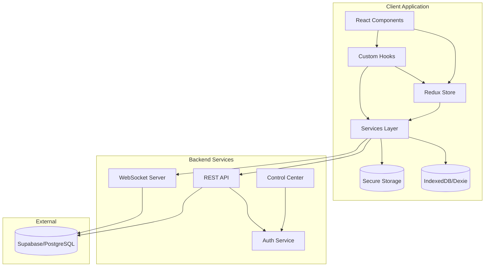
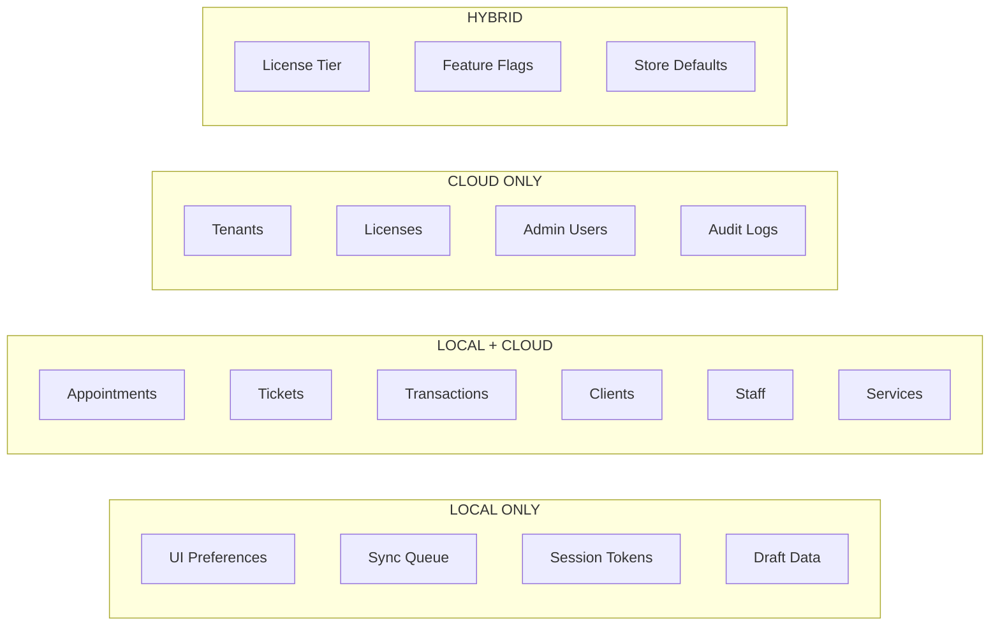
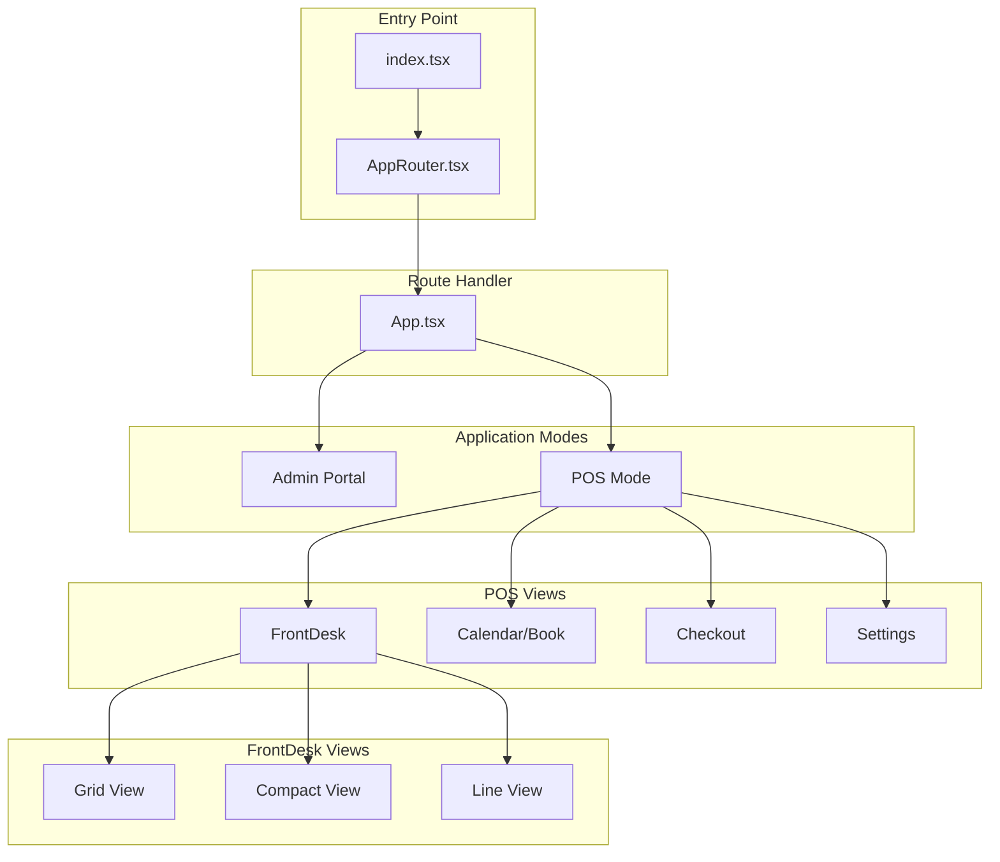
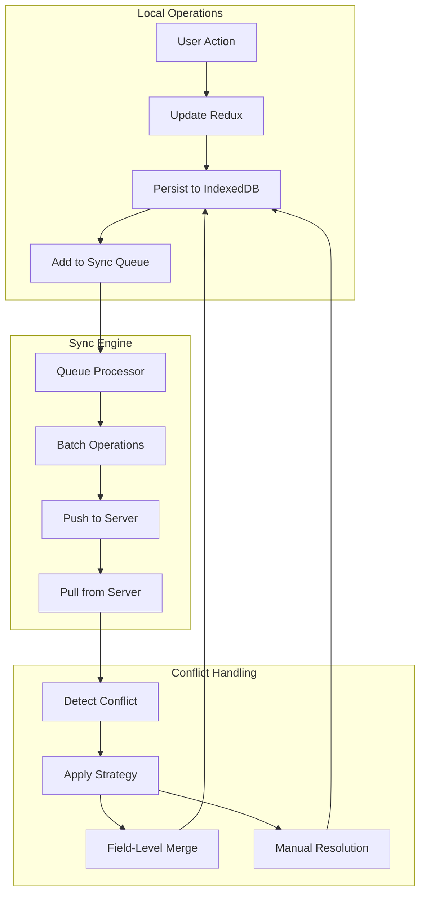
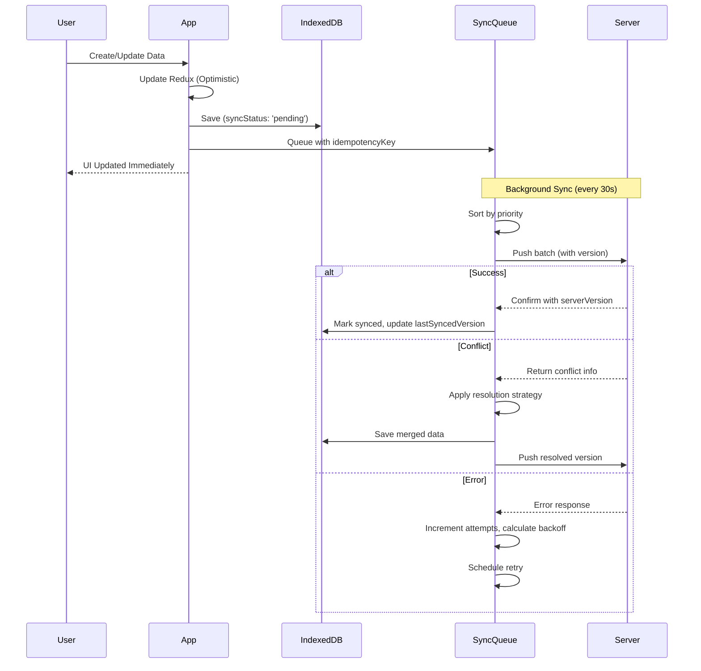
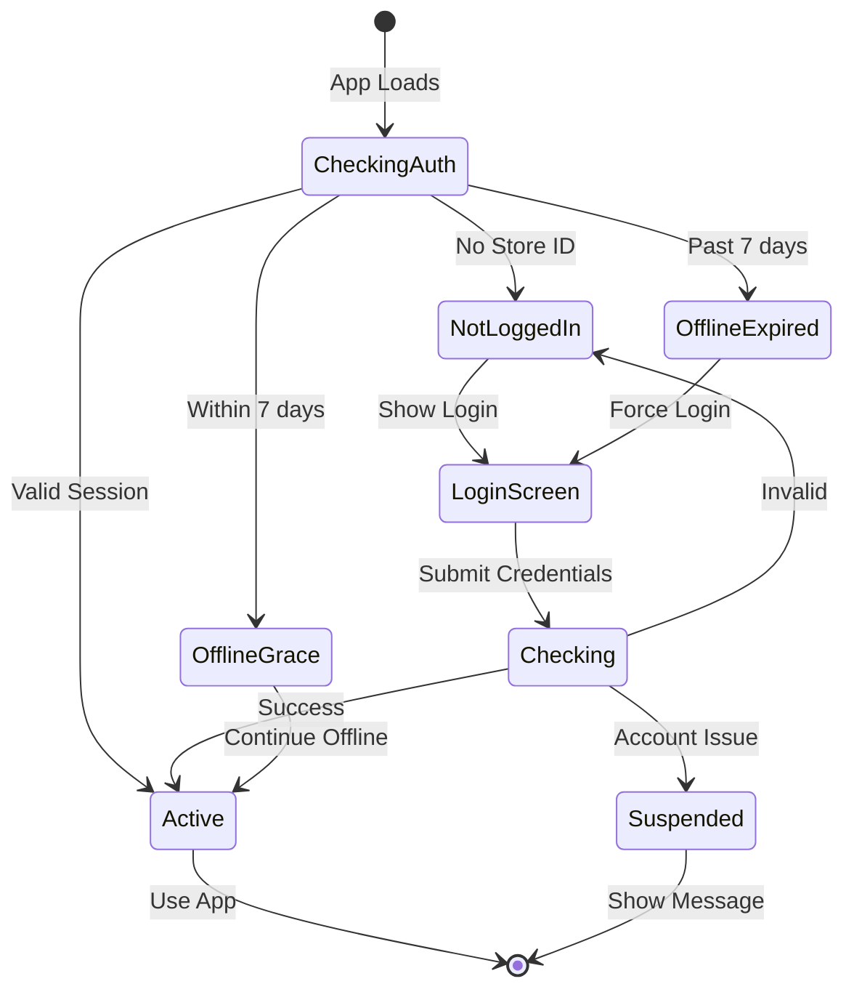
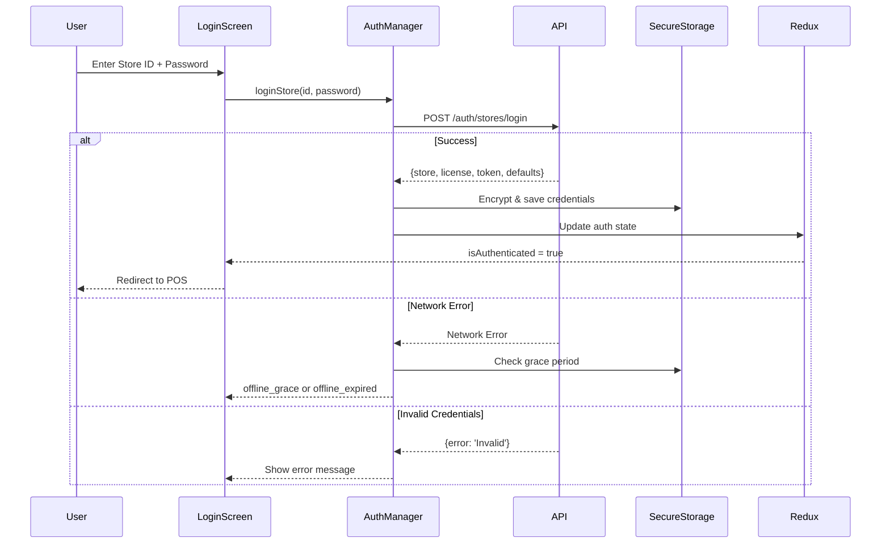

# Mango POS Offline V2 - Technical Documentation

**Version:** 2.0.0 | **Last Updated:** November 30, 2025

---

## Table of Contents

1. [System Overview](#system-overview)
2. [High-Level Architecture](#high-level-architecture)
3. [Technology Stack](#technology-stack)
4. [Data Storage Strategy](#data-storage-strategy)
5. [Component Hierarchy](#component-hierarchy)
6. [State Management (Redux)](#state-management-redux)
7. [Database Schema (IndexedDB)](#database-schema-indexeddb)
8. [Offline Sync System](#offline-sync-system)
9. [Authentication Flow](#authentication-flow)
10. [API Integration](#api-integration)
11. [File Structure](#file-structure)
12. [Security Architecture](#security-architecture)

---

## System Overview

Mango POS is an offline-first salon management system built with React, TypeScript, and IndexedDB. It provides comprehensive salon operations including appointment scheduling, ticket management, payment processing, and staff coordination - all designed to work seamlessly without internet connectivity.

### Key Capabilities

- Appointment booking with smart staff assignment
- Real-time ticket management
- Offline-first data persistence with intelligent sync
- Multi-view front desk (Grid, Compact, Line)
- Turn tracking for staff rotation
- Payment processing and receipts
- Admin portal for multi-store management

### Design Principles

| Principle | Description |
|-----------|-------------|
| **Offline-First** | All operations work without internet; local storage is primary |
| **Optimistic UI** | Immediate feedback on all actions |
| **Automatic Sync** | Background sync with priority-based queue |
| **Smart Conflict Resolution** | Field-level merging with configurable strategies per entity |
| **Mobile Responsive** | Works on all device sizes |
| **PWA Ready** | Installable as native app |
| **Audit Everything** | All mutations traceable to user, device, and time |

---

## High-Level Architecture



### Architecture Layers

| Layer | Responsibility | Key Files |
|-------|----------------|-----------|
| **Presentation** | React components, UI rendering, user interactions | `src/components/`, `src/pages/` |
| **State** | Redux store, slices, selectors, async thunks | `src/store/` |
| **Business Logic** | Services, utilities, hooks for business rules | `src/services/`, `src/hooks/`, `src/utils/` |
| **Data** | IndexedDB operations, sync queue, API calls | `src/db/`, `src/api/` |
| **Security** | Encrypted storage, auth tokens, data isolation | `src/services/secureStorage.ts` |

---

## Technology Stack

| Technology | Purpose |
|------------|---------|
| **React 18** | UI Framework with Hooks |
| **TypeScript** | Type-safe JavaScript |
| **Vite** | Build Tool & Dev Server |
| **Redux Toolkit** | State Management |
| **Dexie.js** | IndexedDB Wrapper with migrations |
| **Tailwind CSS** | Utility-first Styling |
| **React Router** | Client-side Routing |
| **Axios** | HTTP Client |
| **Socket.io** | Real-time Communication |
| **Supabase** | Cloud Backend (PostgreSQL) |
| **Web Crypto API** | AES-256-GCM encryption |

---

## Data Storage Strategy

> **Complete Reference:** See [DATA_STORAGE_STRATEGY.md](./DATA_STORAGE_STRATEGY.md) for comprehensive implementation details including schemas, sync architecture, conflict resolution, and security.

### Overview

Data is categorized into four storage types based on sync requirements, security, and access patterns:



### Storage Categories Summary

| Category | Count | Key Points |
|----------|-------|------------|
| **Local Only** | 9 types | UI prefs, sync queue, tokens, drafts, device state |
| **Local + Cloud** | 7 entities | Appointments, Tickets, Transactions, Clients, Staff, Services, Products |
| **Cloud Only** | 12+ tables | Tenants, Licenses, Admin, Audit Logs, Feature Flags |
| **Hybrid (Cached)** | 7 types | License tier, Store defaults, Feature flags, Permissions |

### Sync Priorities

| Priority | Level | Entities | Description |
|----------|-------|----------|-------------|
| **CRITICAL** | 1 | Transactions, Payments | Must sync immediately when online |
| **HIGH** | 2 | Appointments, Tickets | Business-critical operations |
| **NORMAL** | 3 | Clients, Staff | Important but deferrable |
| **LOW** | 4 | Services, Products | Reference data |
| **BACKGROUND** | 5 | Analytics, Preferences | Sync when idle |

### Conflict Resolution Strategies

| Entity | Strategy | Key Rules |
|--------|----------|-----------|
| **Appointments** | Field-Merge | Status: latest, Notes: concat, Services: merge arrays |
| **Tickets** | Field-Merge | Payments: server-wins, Line items: merge arrays |
| **Transactions** | Server-Wins | All fields - financial data integrity |
| **Clients** | Field-Merge | Visits/Spend: max, Tags: merge arrays |
| **Staff** | Last-Write-Wins | Real-time fields: server-wins |
| **Services/Products** | Server-Wins | Reference data - server authoritative |

> **Implementation Details:** See [Section 4: Conflict Resolution](./DATA_STORAGE_STRATEGY.md#4-conflict-resolution) for complete conflict detection and resolution algorithms.

---

## Component Hierarchy



### Key Components

| Component | Size | Purpose |
|-----------|------|---------|
| `FrontDesk.tsx` | ~1004 lines | Main front desk screen with view switching |
| `StaffCard.tsx` | ~3500+ lines | Complex staff card with appointments/tickets |
| `FrontDeskSettings.tsx` | ~96KB | Comprehensive settings panel |
| `Checkout.tsx` | ~800+ lines | Payment processing flow |

---

## State Management (Redux)

### Store Structure

```typescript
{
  appointments: AppointmentsState,
  tickets: TicketsState,
  transactions: TransactionsState,
  staff: StaffState,
  clients: ClientsState,
  services: ServicesState,
  auth: AuthState,
  sync: SyncState,
  ui: UIState
}
```

### Slice Pattern

Each entity slice follows this pattern:

```typescript
interface EntityState<T> {
  items: T[];
  selectedId: string | null;
  loading: boolean;
  error: string | null;
  filters: FilterState;
  lastFetched: string | null;
}
```

### Key Slices

| Slice | Async Thunks | Selectors |
|-------|--------------|-----------|
| `appointmentsSlice` | fetchAppointments, createAppointment, updateAppointment | selectTodayAppointments, selectByStaff |
| `ticketsSlice` | fetchTickets, createTicket, updateTicket | selectOpenTickets, selectByClient |
| `syncSlice` | pushChanges, pullChanges, resolveConflict | selectPendingCount, selectSyncStatus |
| `authSlice` | loginStore, logout, validateSession | selectIsAuthenticated, selectCurrentStore |

---

## Database Schema (IndexedDB)

### Schema Definition (Dexie.js)

```typescript
db.version(3).stores({
  appointments: 'id, storeId, clientId, staffId, status, scheduledStartTime, [storeId+status], [storeId+scheduledStartTime], [staffId+scheduledStartTime], [clientId+createdAt], [storeId+isDeleted]',

  tickets: 'id, ticketNumber, storeId, clientId, appointmentId, status, createdAt, [storeId+status], [storeId+createdAt], [clientId+createdAt]',

  transactions: 'id, ticketId, ticketNumber, storeId, clientId, status, paymentMethod, createdAt, [storeId+createdAt], [storeId+status], [clientId+createdAt]',

  clients: 'id, storeId, email, phone, displayName, lastVisitAt, [storeId+displayName], [storeId+phone], [storeId+email], [storeId+lastVisitAt], [storeId+isDeleted]',

  staff: 'id, storeId, email, role, status, [storeId+status], [storeId+role], [storeId+isDeleted]',

  services: 'id, storeId, categoryId, isActive, displayOrder, [storeId+categoryId], [storeId+isActive], [storeId+isDeleted]',

  products: 'id, storeId, sku, barcode, categoryId, isActive, [storeId+categoryId], [storeId+isActive], [storeId+isDeleted]',

  syncQueue: '++localId, id, entity, entityId, status, priority, createdAt, [status+priority], [entity+entityId]',

  syncMeta: 'entity',
  conflicts: 'id, entityType, entityId, status, createdAt, [status+createdAt]',
  syncErrors: '++localId, entity, entityId, createdAt',
  cache: 'key, expiresAt',
  settings: 'key',
});
```

### Base Entity Interface

All synced entities extend this base:

```typescript
interface BaseSyncableEntity {
  id: string;                         // UUID v4
  tenantId: string;
  storeId: string;
  locationId?: string;

  // Sync metadata
  syncStatus: 'local' | 'synced' | 'pending' | 'syncing' | 'conflict' | 'error';
  version: number;                    // Monotonic counter
  vectorClock: Record<string, number>; // { deviceId: lastSeenVersion }
  lastSyncedVersion: number;

  // Timestamps
  createdAt: string;                  // ISO 8601
  updatedAt: string;

  // Audit trail
  createdBy: string;
  createdByDevice: string;
  lastModifiedBy: string;
  lastModifiedByDevice: string;

  // Soft delete (tombstone)
  isDeleted: boolean;
  deletedAt?: string;
  deletedBy?: string;
  deletedByDevice?: string;
  tombstoneExpiresAt?: string;
}
```

> **Complete Schemas:** See [Section 2: Core Entity Schemas](./DATA_STORAGE_STRATEGY.md#2-core-entity-schemas) for full TypeScript interfaces for all entities.

---

## Offline Sync System

### Sync Architecture



### Sync Configuration

| Setting | Value | Description |
|---------|-------|-------------|
| Sync Interval | 30 seconds | Background sync frequency |
| Batch Size | 50 operations | Max operations per sync |
| Max Retries | 5 attempts | With exponential backoff |
| Initial Backoff | 1 second | First retry delay |
| Max Backoff | 5 minutes | Maximum retry delay |
| Jitter Factor | 10% | Random delay to prevent thundering herd |
| Offline Grace | 7 days | Before requiring re-auth |

### Sync Operation Lifecycle



> **Complete Sync Architecture:** See [Section 3: Sync Architecture](./DATA_STORAGE_STRATEGY.md#3-sync-architecture) for queue structure, retry strategy, and checkpoint management.

---

## Authentication Flow



### Auth States

| State | Description | User Experience |
|-------|-------------|-----------------|
| `not_logged_in` | No store session exists | Show login screen |
| `active` | Logged in and validated | Full app access |
| `offline_grace` | Offline but within 7-day grace | Full access, warning shown |
| `offline_expired` | Grace period expired | Must reconnect to login |
| `suspended` | Account suspended | Show suspended message |
| `checking` | Validating credentials | Show loading spinner |

### Login Sequence



---

## API Integration

### API Client Configuration

```typescript
const apiClient = axios.create({
  baseURL: import.meta.env.VITE_API_URL || '',
  timeout: 30000,
  headers: { 'Content-Type': 'application/json' }
});

// Request interceptor for auth
apiClient.interceptors.request.use(async (config) => {
  const token = await secureStorage.getItem('auth_token');
  if (token) {
    config.headers.Authorization = `Bearer ${token}`;
  }
  return config;
});
```

### API Endpoints

| Endpoint | Method | Purpose |
|----------|--------|---------|
| `/auth/stores/login` | POST | Store authentication |
| `/auth/members/login` | POST | Member authentication |
| `/auth/pin/login` | POST | PIN-based login |
| `/appointments` | GET/POST | List/Create appointments |
| `/appointments/{id}` | GET/PUT/DELETE | Single appointment operations |
| `/tickets` | GET/POST | List/Create tickets |
| `/tickets/{id}/complete` | POST | Complete a ticket |
| `/sync/push` | POST | Push local changes (batched) |
| `/sync/pull` | GET | Pull remote changes (since checkpoint) |
| `/sync/conflicts` | GET/POST | Conflict resolution |

---

## File Structure

```
src/
├── index.tsx              # App entry point
├── App.tsx                # Main router & auth check
├── store/                 # Redux state management
│   ├── index.ts           # Store configuration
│   ├── hooks.ts           # Typed hooks
│   └── slices/            # Redux slices
│       ├── appointmentsSlice.ts
│       ├── ticketsSlice.ts
│       ├── staffSlice.ts
│       ├── clientsSlice.ts
│       ├── transactionsSlice.ts
│       ├── authSlice.ts
│       ├── syncSlice.ts
│       └── ui*.ts
├── db/                    # Database layer
│   ├── database.ts        # All CRUD operations
│   ├── schema.ts          # Dexie schema with migrations
│   ├── hooks.ts           # React hooks
│   ├── sync/              # Sync engine
│   │   ├── syncQueue.ts
│   │   ├── syncProcessor.ts
│   │   ├── conflictResolver.ts
│   │   └── retryStrategy.ts
│   └── seed.ts            # Sample data
├── types/                 # TypeScript definitions
│   ├── index.ts
│   ├── entities/          # Entity interfaces
│   │   ├── base.ts        # BaseSyncableEntity
│   │   ├── appointment.ts
│   │   ├── ticket.ts
│   │   ├── transaction.ts
│   │   ├── client.ts
│   │   ├── staff.ts
│   │   └── service.ts
│   └── sync.ts            # Sync-related types
├── services/              # Business logic
│   ├── appointmentService.ts
│   ├── syncManager.ts     # Sync orchestration
│   ├── syncService.ts
│   ├── storeAuthManager.ts
│   ├── secureStorage.ts   # AES-256 encrypted storage
│   └── dataPurgeService.ts # Retention policy enforcement
├── components/            # React components
│   ├── frontdesk/         # Front desk module
│   │   ├── FrontDesk.tsx  # Main component
│   │   └── ...
│   ├── Book/              # Booking calendar
│   ├── tickets/           # Ticket components
│   ├── checkout/          # Payment flow
│   ├── TurnTracker/       # Turn management
│   ├── StaffCard.tsx      # Staff card (3500+ lines)
│   └── common/            # Reusable UI
├── hooks/                 # Custom React hooks
│   ├── useSync.ts
│   ├── useOfflineStatus.ts
│   └── useConflictResolution.ts
├── utils/                 # Utility functions
│   ├── smartAutoAssign.ts
│   ├── conflictDetection.ts
│   ├── versionVector.ts
│   └── ...
├── api/                   # API layer
│   ├── client.ts          # Axios setup
│   ├── endpoints.ts       # API definitions
│   └── storeAuthApi.ts
├── admin/                 # Admin portal
│   ├── AdminPortal.tsx
│   ├── pages/
│   ├── types/
│   └── db/
└── constants/             # Design system
    ├── designSystem.ts
    └── premiumDesignTokens.ts
```

### Key Files Reference

| File | Size | Purpose |
|------|------|---------|
| `src/components/frontdesk/FrontDesk.tsx` | ~1004 lines | Main front desk screen |
| `src/components/StaffCard.tsx` | ~3500+ lines | Complex staff card component |
| `src/db/database.ts` | ~481 lines | All database CRUD operations |
| `src/db/sync/conflictResolver.ts` | ~400 lines | Field-level conflict resolution |
| `src/services/secureStorage.ts` | ~200 lines | AES-256-GCM encryption |
| `src/services/syncManager.ts` | ~300+ lines | Offline sync orchestration |
| `src/store/slices/appointmentsSlice.ts` | ~300+ lines | Appointment state management |

---

## Security Architecture

### Sensitive Data Classification

| Data Type | Sensitivity | Storage Method | Encryption |
|-----------|-------------|----------------|------------|
| License Key | High | Encrypted IndexedDB | AES-256-GCM |
| Auth Tokens | High | Encrypted IndexedDB | AES-256-GCM |
| Refresh Tokens | High | Encrypted IndexedDB | AES-256-GCM |
| Staff PINs | High | Cloud only | bcrypt hashed |
| Client PII | Medium | IndexedDB | Application-level |
| Payment Card Details | Critical | **Never stored** | PCI compliance |
| Transaction History | Medium | IndexedDB | No |
| Business Data | Low | IndexedDB | No |

### Secure Storage Implementation

The application uses the Web Crypto API for encrypting sensitive data:

```typescript
class SecureStorage {
  private key: CryptoKey | null = null;

  async initialize(deviceSecret: string): Promise<void> {
    // Derive key using PBKDF2 with 100,000 iterations
    const keyMaterial = await crypto.subtle.importKey(
      'raw',
      new TextEncoder().encode(deviceSecret),
      'PBKDF2',
      false,
      ['deriveKey']
    );

    const salt = await this.getOrCreateSalt();

    this.key = await crypto.subtle.deriveKey(
      {
        name: 'PBKDF2',
        salt,
        iterations: 100000,
        hash: 'SHA-256',
      },
      keyMaterial,
      { name: 'AES-GCM', length: 256 },
      false,
      ['encrypt', 'decrypt']
    );
  }

  async setItem(key: string, value: any): Promise<void> {
    const iv = crypto.getRandomValues(new Uint8Array(12));
    const data = new TextEncoder().encode(JSON.stringify(value));

    const encrypted = await crypto.subtle.encrypt(
      { name: 'AES-GCM', iv },
      this.key!,
      data
    );

    // Store IV + ciphertext in IndexedDB
    await this.db.put({ key, iv: Array.from(iv), data: Array.from(new Uint8Array(encrypted)) });
  }

  async getItem<T>(key: string): Promise<T | null> {
    const stored = await this.db.get(key);
    if (!stored) return null;

    const decrypted = await crypto.subtle.decrypt(
      { name: 'AES-GCM', iv: new Uint8Array(stored.iv) },
      this.key!,
      new Uint8Array(stored.data)
    );

    return JSON.parse(new TextDecoder().decode(decrypted));
  }
}
```

> **Complete Security Details:** See [Section 5: Security & Encryption](./DATA_STORAGE_STRATEGY.md#5-security--encryption) for full implementation.

### Data Isolation

- All POS data filtered by `storeId` with compound indexes
- All Admin data filtered by `tenantId` with Row-Level Security
- Device registration prevents token sharing across devices
- 7-day offline grace period enforces re-validation
- Audit trail on all mutations (userId, deviceId, timestamp)

### Data Retention

| Data Type | Local Retention | Cloud Retention |
|-----------|-----------------|-----------------|
| Appointments | 90 days / 10K max | Archive after 2 years |
| Tickets | 1 year / 50K max | 7 years (tax compliance) |
| Transactions | 1 year cache | 7 years (tax compliance) |
| Clients | Indefinite if active | Anonymize after 3 years inactive (GDPR) |
| Sync Queue | 7 days | N/A |
| Audit Logs | N/A | 7 years |

> **Retention Policies:** See [Section 6: Data Retention & Purge](./DATA_STORAGE_STRATEGY.md#6-data-retention--purge) for complete policies and purge implementation.

---

## Related Documentation

| Document | Description |
|----------|-------------|
| [DATA_STORAGE_STRATEGY.md](./DATA_STORAGE_STRATEGY.md) | Complete data storage architecture with entity schemas, sync, conflicts, security |
| [PRD-Opt-In-Offline-Mode.md](../product/PRD-Opt-In-Offline-Mode.md) | **Planned** - Online-only by default, opt-in offline mode |
| [Mango POS PRD v1.md](../product/Mango%20POS%20PRD%20v1.md) | Product requirements document |

---

## Revision History

| Version | Date | Author | Changes |
|---------|------|--------|---------|
| 2.0.0 | Nov 30, 2025 | Engineering | Updated to reference DATA_STORAGE_STRATEGY.md, removed duplication, updated security section with AES-256 |
| 1.0.0 | Nov 2025 | Engineering | Initial documentation |

---

*Generated: November 30, 2025*
