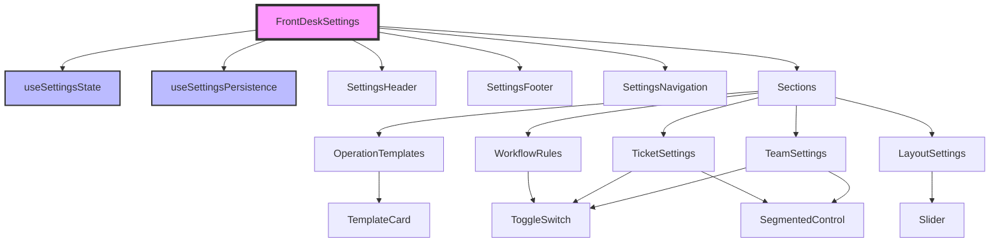

# FrontDeskSettings Refactoring Plan

## Executive Summary

The `FrontDeskSettings.tsx` file is a **1,649-line monolithic component** that handles all Front Desk configuration UI and logic. This document outlines a comprehensive plan to refactor it into a modular, maintainable architecture.

**Current Issues:**
- Single file with 1,649 lines of code
- Complex state management (20+ state variables)
- Mixed responsibilities (UI, logic, validation)
- Hard to test and maintain
- Poor code reusability
- Performance concerns with large re-renders

**Goal:** Split into 15+ smaller, focused components with clear separation of concerns.

---

## Current File Analysis

### Structure Breakdown
```
FrontDeskSettings.tsx (1,649 lines)
├── Imports & Type Definitions (lines 1-109)
├── Default Settings Object (lines 110-144)
├── Shared UI Components (lines 145-317)
│   ├── ToggleSwitch
│   ├── SegmentedControl
│   ├── SectionHeader
│   ├── AccordionSection
│   └── TemplateCard
├── Template Helper Functions (lines 318-416)
├── Main Component (lines 417-1649)
│   ├── State Management (20+ useState)
│   ├── Event Handlers
│   ├── Effects (7 useEffect)
│   └── Render Logic (Conditional for mobile/desktop)
└── Inline Styles & Animations
```

### Key Sections in Settings
1. **Operation Templates** - Layout presets
2. **Team Section** - Staff display options
3. **Ticket Section** - Ticket display options
4. **Workflow & Rules** - Business logic rules
5. **Layout Section** - View width controls

---

## Proposed Architecture

### Folder Structure
```
src/
├── components/
│   └── FrontDeskSettings/
│       ├── index.tsx                    // Main container (150 lines)
│       ├── types.ts                     // All TypeScript types
│       ├── constants.ts                 // Default settings & constants
│       ├── hooks/
│       │   ├── useSettingsState.ts      // State management hook
│       │   ├── useSettingsValidation.ts // Validation logic
│       │   └── useSettingsPersistence.ts// Save/load logic
│       ├── sections/
│       │   ├── OperationTemplates.tsx   // Template selection
│       │   ├── TeamSettings.tsx         // Team configuration
│       │   ├── TicketSettings.tsx       // Ticket configuration
│       │   ├── WorkflowRules.tsx        // Business rules
│       │   └── LayoutSettings.tsx       // Layout controls
│       ├── components/
│       │   ├── SettingsHeader.tsx       // Modal header
│       │   ├── SettingsFooter.tsx       // Save/Cancel buttons
│       │   ├── SettingsNavigation.tsx   // Desktop sidebar nav
│       │   ├── MobileAccordion.tsx      // Mobile accordion wrapper
│       │   └── shared/
│       │       ├── ToggleSwitch.tsx
│       │       ├── SegmentedControl.tsx
│       │       ├── SectionHeader.tsx
│       │       ├── RadioGroup.tsx
│       │       └── Slider.tsx
│       └── utils/
│           ├── templatePresets.ts       // Template configurations
│           ├── validation.ts            // Settings validation
│           └── dependencies.ts          // Setting dependencies
```

---

## Implementation Plan

### Phase 1: Setup & Types (2 hours)

#### Step 1.1: Create folder structure
```bash
mkdir -p src/components/FrontDeskSettings/{hooks,sections,components/shared,utils}
```

#### Step 1.2: Extract types to `types.ts`
```typescript
// src/components/FrontDeskSettings/types.ts
export interface FrontDeskSettingsData {
  // Operation Template
  operationTemplate: 'frontDeskBalanced' | 'frontDeskTicketCenter' | 'teamWithOperationFlow' | 'teamInOut';

  // Team Settings
  organizeBy: 'clockedStatus' | 'busyStatus';
  showTurnCount: boolean;
  showNextAppointment: boolean;
  showServicedAmount: boolean;
  showTicketCount: boolean;
  showLastDone: boolean;
  showMoreOptionsButton: boolean;
  viewWidth: 'ultraCompact' | 'compact' | 'wide' | 'fullScreen' | 'custom';
  customWidthPercentage: number;

  // Ticket Settings
  displayMode: 'column' | 'tab';
  viewStyle: 'expanded' | 'compact';
  showWaitList: boolean;
  showInService: boolean;
  showPending: boolean;
  closedTicketsPlacement: 'floating' | 'bottom' | 'hidden';
  sortBy: 'queue' | 'time';
  combineSections: boolean;

  // Workflow & Rules
  showComingAppointments: boolean;
  comingAppointmentsDefaultState: 'expanded' | 'collapsed';
  enableDragAndDrop: boolean;
  autoCloseAfterCheckout: boolean;
  autoNoShowCancel: boolean;
  autoNoShowTime: number;
  alertPendingTime: boolean;
  pendingAlertMinutes: number;

  // UI Controls - Team
  showAddTicketAction: boolean;
  showAddNoteAction: boolean;
  showEditTeamAction: boolean;
  showQuickCheckoutAction: boolean;

  // UI Controls - Ticket
  showApplyDiscountAction: boolean;
  showRedeemBenefitsAction: boolean;
  showTicketNoteAction: boolean;
  showStartServiceAction: boolean;
  showPendingPaymentAction: boolean;
  showDeleteTicketAction: boolean;

  // Workflow Activation
  waitListActive: boolean;
  inServiceActive: boolean;
}

export interface FrontDeskSettingsProps {
  isOpen: boolean;
  onClose: () => void;
  currentSettings: FrontDeskSettingsData;
  onSettingsChange: (settings: Partial<FrontDeskSettingsData>) => void;
}
```

#### Step 1.3: Extract constants to `constants.ts`
```typescript
// src/components/FrontDeskSettings/constants.ts
import { FrontDeskSettingsData } from './types';

export const DEFAULT_SETTINGS: FrontDeskSettingsData = {
  operationTemplate: 'frontDeskBalanced',
  organizeBy: 'busyStatus',
  showTurnCount: true,
  // ... rest of default settings
};

export const TEMPLATE_PRESETS = {
  frontDeskBalanced: {
    viewWidth: 'wide',
    customWidthPercentage: 40,
    displayMode: 'column',
    combineSections: false,
    showComingAppointments: true,
    organizeBy: 'busyStatus',
  },
  // ... other presets
};
```

---

### Phase 2: Extract Shared Components (3 hours)

#### Step 2.1: Extract ToggleSwitch
```typescript
// src/components/FrontDeskSettings/components/shared/ToggleSwitch.tsx
import React from 'react';
import { Circle, CheckCircle2 } from 'lucide-react';

interface ToggleSwitchProps {
  checked: boolean;
  onChange: (checked: boolean) => void;
  label: string;
  description?: string;
  disabled?: boolean;
}

export const ToggleSwitch: React.FC<ToggleSwitchProps> = ({
  checked,
  onChange,
  label,
  description,
  disabled = false
}) => {
  return (
    <div className="group flex items-start justify-between py-2 w-full">
      <div className="flex flex-col pr-3">
        <span className={`text-sm font-medium ${disabled ? 'text-gray-400' : 'text-gray-800'}`}>
          {label}
        </span>
        {description && (
          <span className="text-xs text-gray-500 mt-0.5 max-w-[90%] leading-tight">
            {description}
          </span>
        )}
      </div>
      <button
        type="button"
        role="switch"
        aria-checked={checked}
        disabled={disabled}
        className={`relative inline-flex h-6 w-11 flex-shrink-0 rounded-full border-2 border-transparent transition-colors duration-200 ease-in-out focus:outline-none focus-visible:ring focus-visible:ring-[#27AE60]/30 ${
          disabled ? 'opacity-50 cursor-not-allowed' : 'cursor-pointer'
        } ${checked ? 'bg-[#27AE60]' : 'bg-gray-200'}`}
        onClick={() => !disabled && onChange(!checked)}
      >
        {/* Switch implementation */}
      </button>
    </div>
  );
};
```

#### Step 2.2: Extract other shared components
- SegmentedControl.tsx
- SectionHeader.tsx
- RadioGroup.tsx
- Slider.tsx

---

### Phase 3: Create Custom Hooks (3 hours)

#### Step 3.1: useSettingsState hook
```typescript
// src/components/FrontDeskSettings/hooks/useSettingsState.ts
import { useState, useCallback, useEffect } from 'react';
import { FrontDeskSettingsData } from '../types';
import { DEFAULT_SETTINGS } from '../constants';

export const useSettingsState = (
  initialSettings: FrontDeskSettingsData
) => {
  const [settings, setSettings] = useState<FrontDeskSettingsData>(initialSettings);
  const [hasChanges, setHasChanges] = useState(false);
  const [errors, setErrors] = useState<Record<string, string>>({});

  const updateSetting = useCallback(<K extends keyof FrontDeskSettingsData>(
    key: K,
    value: FrontDeskSettingsData[K]
  ) => {
    setSettings(prev => {
      const newSettings = { ...prev, [key]: value };

      // Handle dependencies
      if (key === 'inServiceActive' && value === true && !newSettings.waitListActive) {
        newSettings.waitListActive = true;
      }

      return newSettings;
    });
    setHasChanges(true);
  }, []);

  const resetToDefaults = useCallback(() => {
    setSettings(DEFAULT_SETTINGS);
    setHasChanges(true);
  }, []);

  const applyTemplate = useCallback((templateId: string) => {
    // Apply template logic
  }, []);

  return {
    settings,
    hasChanges,
    errors,
    updateSetting,
    resetToDefaults,
    applyTemplate,
  };
};
```

#### Step 3.2: useSettingsPersistence hook
```typescript
// src/components/FrontDeskSettings/hooks/useSettingsPersistence.ts
import { useCallback } from 'react';
import { FrontDeskSettingsData } from '../types';

export const useSettingsPersistence = () => {
  const saveToLocalStorage = useCallback((settings: FrontDeskSettingsData) => {
    try {
      localStorage.setItem('frontDeskSettings', JSON.stringify(settings));
      return true;
    } catch (error) {
      console.error('Failed to save settings:', error);
      return false;
    }
  }, []);

  const loadFromLocalStorage = useCallback((): FrontDeskSettingsData | null => {
    try {
      const stored = localStorage.getItem('frontDeskSettings');
      return stored ? JSON.parse(stored) : null;
    } catch (error) {
      console.error('Failed to load settings:', error);
      return null;
    }
  }, []);

  return {
    saveToLocalStorage,
    loadFromLocalStorage,
  };
};
```

---

### Phase 4: Extract Section Components (4 hours)

#### Step 4.1: OperationTemplates.tsx
```typescript
// src/components/FrontDeskSettings/sections/OperationTemplates.tsx
import React from 'react';
import { Layers } from 'lucide-react';
import { FrontDeskSettingsData } from '../types';
import { TemplateCard } from '../components/TemplateCard';
import { SectionHeader } from '../components/shared/SectionHeader';

interface OperationTemplatesProps {
  settings: FrontDeskSettingsData;
  onTemplateChange: (template: FrontDeskSettingsData['operationTemplate']) => void;
  onOpenTemplateSetup: () => void;
}

export const OperationTemplates: React.FC<OperationTemplatesProps> = ({
  settings,
  onTemplateChange,
  onOpenTemplateSetup,
}) => {
  const templates = [
    {
      id: 'frontDeskBalanced',
      title: 'Front Desk Balanced',
      description: 'Balanced view of team and tickets with 40/60 ratio',
      layoutRatio: { team: 40, ticket: 60 },
    },
    // ... other templates
  ];

  return (
    <div className="space-y-4">
      <SectionHeader title="Operation Templates" icon={<Layers />} />

      <div className="grid grid-cols-2 gap-3">
        {templates.map(template => (
          <TemplateCard
            key={template.id}
            {...template}
            isSelected={settings.operationTemplate === template.id}
            onSelect={() => onTemplateChange(template.id as FrontDeskSettingsData['operationTemplate'])}
          />
        ))}
      </div>

      <button
        onClick={onOpenTemplateSetup}
        className="w-full px-4 py-2 bg-[#27AE60] text-white rounded-lg hover:bg-[#219653] transition-colors"
      >
        Advanced Template Setup
      </button>
    </div>
  );
};
```

#### Step 4.2: TeamSettings.tsx
```typescript
// src/components/FrontDeskSettings/sections/TeamSettings.tsx
import React from 'react';
import { Users } from 'lucide-react';
import { FrontDeskSettingsData } from '../types';
import { SectionHeader } from '../components/shared/SectionHeader';
import { ToggleSwitch } from '../components/shared/ToggleSwitch';
import { SegmentedControl } from '../components/shared/SegmentedControl';

interface TeamSettingsProps {
  settings: FrontDeskSettingsData;
  onSettingChange: <K extends keyof FrontDeskSettingsData>(
    key: K,
    value: FrontDeskSettingsData[K]
  ) => void;
}

export const TeamSettings: React.FC<TeamSettingsProps> = ({
  settings,
  onSettingChange,
}) => {
  return (
    <div className="space-y-6">
      <SectionHeader title="Team Section" icon={<Users />} />

      {/* Display Options */}
      <div className="space-y-3">
        <h4 className="text-sm font-semibold text-gray-700">Display Options</h4>
        <div className="space-y-4 bg-gray-50 p-3.5 rounded-xl">
          <div>
            <label className="block text-sm font-medium text-gray-700 mb-1.5">
              Organize Team By
            </label>
            <SegmentedControl
              options={[
                { value: 'busyStatus', label: 'Ready/Busy' },
                { value: 'clockedStatus', label: 'Clocked In/Out' },
              ]}
              value={settings.organizeBy}
              onChange={(value) => onSettingChange('organizeBy', value as 'clockedStatus' | 'busyStatus')}
              name="organizeBy"
            />
          </div>
        </div>
      </div>

      {/* Card Data */}
      <div className="space-y-3">
        <h4 className="text-sm font-semibold text-gray-700">Card Data</h4>
        <div className="space-y-2 bg-gray-50 p-3.5 rounded-xl">
          <ToggleSwitch
            checked={settings.showTurnCount}
            onChange={(checked) => onSettingChange('showTurnCount', checked)}
            label="Turn Count"
            description="Number of turns the staff member has taken"
          />
          <ToggleSwitch
            checked={settings.showNextAppointment}
            onChange={(checked) => onSettingChange('showNextAppointment', checked)}
            label="Next Appointment Time"
            description="Shows upcoming appointment time and details"
          />
          {/* ... other toggles */}
        </div>
      </div>

      {/* UI Controls */}
      <div className="space-y-3">
        <h4 className="text-sm font-semibold text-gray-700">UI Controls</h4>
        <div className="space-y-2 bg-gray-50 p-3.5 rounded-xl">
          <ToggleSwitch
            checked={settings.showAddTicketAction}
            onChange={(checked) => onSettingChange('showAddTicketAction', checked)}
            label="Add Ticket"
            description="Allow adding tickets from staff cards"
          />
          {/* ... other controls */}
        </div>
      </div>
    </div>
  );
};
```

#### Step 4.3: Extract other sections
- TicketSettings.tsx
- WorkflowRules.tsx
- LayoutSettings.tsx

---

### Phase 5: Create Main Container (2 hours)

```typescript
// src/components/FrontDeskSettings/index.tsx
import React, { useState, useEffect, useRef } from 'react';
import { createPortal } from 'react-dom';
import { X, Settings } from 'lucide-react';
import FocusTrap from 'focus-trap-react';

import { FrontDeskSettingsProps } from './types';
import { useSettingsState } from './hooks/useSettingsState';
import { useSettingsPersistence } from './hooks/useSettingsPersistence';

import { SettingsHeader } from './components/SettingsHeader';
import { SettingsFooter } from './components/SettingsFooter';
import { SettingsNavigation } from './components/SettingsNavigation';
import { MobileAccordion } from './components/MobileAccordion';

import { OperationTemplates } from './sections/OperationTemplates';
import { TeamSettings } from './sections/TeamSettings';
import { TicketSettings } from './sections/TicketSettings';
import { WorkflowRules } from './sections/WorkflowRules';
import { LayoutSettings } from './sections/LayoutSettings';

export const FrontDeskSettings: React.FC<FrontDeskSettingsProps> = ({
  isOpen,
  onClose,
  currentSettings,
  onSettingsChange,
}) => {
  const [activeSection, setActiveSection] = useState('operationTemplates');
  const [isMobile, setIsMobile] = useState(window.innerWidth < 768);

  const {
    settings,
    hasChanges,
    updateSetting,
    applyTemplate,
  } = useSettingsState(currentSettings);

  const { saveToLocalStorage } = useSettingsPersistence();

  const handleSave = () => {
    onSettingsChange(settings);
    saveToLocalStorage(settings);
    onClose();
  };

  const handleCancel = () => {
    if (hasChanges) {
      const confirm = window.confirm('You have unsaved changes. Are you sure you want to discard them?');
      if (!confirm) return;
    }
    onClose();
  };

  useEffect(() => {
    const handleResize = () => setIsMobile(window.innerWidth < 768);
    window.addEventListener('resize', handleResize);
    return () => window.removeEventListener('resize', handleResize);
  }, []);

  if (!isOpen) return null;

  const sections = {
    operationTemplates: (
      <OperationTemplates
        settings={settings}
        onTemplateChange={applyTemplate}
        onOpenTemplateSetup={() => {/* handle */}}
      />
    ),
    teamSettings: (
      <TeamSettings
        settings={settings}
        onSettingChange={updateSetting}
      />
    ),
    ticketSettings: (
      <TicketSettings
        settings={settings}
        onSettingChange={updateSetting}
      />
    ),
    workflowRules: (
      <WorkflowRules
        settings={settings}
        onSettingChange={updateSetting}
      />
    ),
    layoutSettings: (
      <LayoutSettings
        settings={settings}
        onSettingChange={updateSetting}
      />
    ),
  };

  return createPortal(
    <FocusTrap>
      <div className="fixed inset-0 z-[1050] overflow-hidden bg-black/40 backdrop-blur-[2px] flex items-center justify-center">
        <div className="bg-white rounded-2xl shadow-xl overflow-hidden flex flex-col max-w-4xl max-h-[90vh]">
          <SettingsHeader onClose={handleCancel} />

          <div className="flex flex-1 overflow-hidden">
            {!isMobile && (
              <SettingsNavigation
                activeSection={activeSection}
                onSectionChange={setActiveSection}
              />
            )}

            <div className="flex-1 overflow-y-auto p-6">
              {isMobile ? (
                <MobileAccordion sections={sections} />
              ) : (
                sections[activeSection as keyof typeof sections]
              )}
            </div>
          </div>

          <SettingsFooter
            hasChanges={hasChanges}
            onSave={handleSave}
            onCancel={handleCancel}
          />
        </div>
      </div>
    </FocusTrap>,
    document.body
  );
};
```

---

## Migration Strategy

### Step-by-Step Migration

#### Week 1: Foundation
1. **Day 1-2**: Create folder structure and extract types/constants
2. **Day 3-4**: Extract and test shared components
3. **Day 5**: Create custom hooks

#### Week 2: Components
1. **Day 1-2**: Extract section components
2. **Day 3-4**: Build main container
3. **Day 5**: Integration testing

### Testing Strategy

#### Unit Tests
```typescript
// __tests__/ToggleSwitch.test.tsx
describe('ToggleSwitch', () => {
  it('renders with label and description', () => {});
  it('handles click events', () => {});
  it('respects disabled state', () => {});
});
```

#### Integration Tests
```typescript
// __tests__/FrontDeskSettings.test.tsx
describe('FrontDeskSettings', () => {
  it('saves settings correctly', () => {});
  it('handles template changes', () => {});
  it('validates dependencies', () => {});
});
```

---

## Benefits of Refactoring

### Immediate Benefits
1. **Maintainability**: Each component under 200 lines
2. **Testability**: Isolated units for testing
3. **Reusability**: Shared components across app
4. **Performance**: Smaller re-renders with memoization
5. **Developer Experience**: Easier to find and modify code

### Long-term Benefits
1. **Scalability**: Easy to add new settings sections
2. **Code Sharing**: Reuse components in other modules
3. **Team Collaboration**: Multiple developers can work in parallel
4. **Documentation**: Self-documenting component structure
5. **Type Safety**: Better TypeScript inference

---

## Performance Optimizations

### Component Memoization
```typescript
export const TeamSettings = React.memo(({ settings, onSettingChange }) => {
  // Component implementation
});
```

### Lazy Loading
```typescript
const OperationTemplateSetup = React.lazy(() =>
  import('./components/OperationTemplateSetup')
);
```

### Virtual Scrolling for Long Lists
```typescript
import { FixedSizeList } from 'react-window';
```

---

## Risk Mitigation

### Potential Risks
1. **Breaking Changes**: Settings not saving correctly
2. **UI Inconsistencies**: Styles not matching
3. **State Management**: Lost updates during refactor
4. **Performance Regression**: Increased re-renders

### Mitigation Strategies
1. **Feature Flags**: Roll out gradually
2. **A/B Testing**: Compare old vs new
3. **Snapshot Testing**: Catch UI changes
4. **Performance Monitoring**: Track render times
5. **Rollback Plan**: Keep old component available

---

## Success Metrics

### Code Quality Metrics
- **File Size**: No file > 300 lines
- **Component Count**: 15-20 focused components
- **Test Coverage**: > 80%
- **Type Coverage**: 100%

### Performance Metrics
- **Initial Load**: < 50ms
- **Interaction Time**: < 100ms
- **Re-render Time**: < 16ms
- **Bundle Size**: < 100KB

### Developer Experience Metrics
- **Time to Find Code**: < 30 seconds
- **Time to Add Feature**: 50% reduction
- **Code Review Time**: 30% reduction
- **Bug Fix Time**: 40% reduction

---

## Timeline & Resources

### Timeline
- **Total Duration**: 2 weeks
- **Development**: 8 days
- **Testing**: 3 days
- **Integration**: 2 days
- **Documentation**: 1 day

### Resources Required
- **Developer Time**: 1 developer, full-time
- **Code Review**: 4 hours from senior developer
- **QA Testing**: 8 hours
- **User Testing**: 4 hours

### Deliverables
1. Refactored component structure
2. Unit tests (80% coverage)
3. Integration tests
4. Performance benchmarks
5. Migration documentation
6. Developer guide

---

## Conclusion

This refactoring will transform the FrontDeskSettings from a monolithic 1,649-line component into a modular, maintainable architecture with:

- **15+ focused components**
- **Clear separation of concerns**
- **Improved testability**
- **Better performance**
- **Enhanced developer experience**

The investment of 2 weeks will pay dividends in reduced maintenance costs, faster feature development, and improved code quality for the lifetime of the application.

---

## Appendix A: Component Dependencies Graph



---

## Appendix B: File Size Comparison

### Before Refactoring
```
FrontDeskSettings.tsx: 1,649 lines (62KB)
```

### After Refactoring
```
index.tsx:              150 lines (5KB)
types.ts:               80 lines (3KB)
constants.ts:           60 lines (2KB)
useSettingsState.ts:    120 lines (4KB)
OperationTemplates.tsx: 180 lines (6KB)
TeamSettings.tsx:       200 lines (7KB)
TicketSettings.tsx:     220 lines (8KB)
WorkflowRules.tsx:      180 lines (6KB)
LayoutSettings.tsx:     150 lines (5KB)
ToggleSwitch.tsx:       80 lines (3KB)
SegmentedControl.tsx:   60 lines (2KB)
Other components:       ~300 lines (10KB)
──────────────────────────────────────
Total:                  1,780 lines (61KB)
Largest file:           220 lines (8KB)
```

The total code is similar, but now:
- **No file exceeds 220 lines**
- **Average file size: 120 lines**
- **Improved modularity and maintainability**